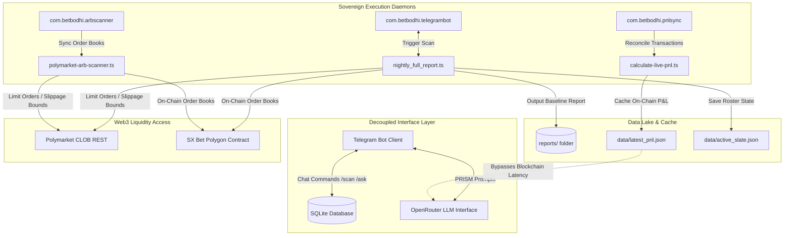

# 🧠 Bet Bodhi: Sovereign AI Sports Trading Agent

Welcome to the **Bet Bodhi** master repository. Bodhi has evolved from a passive analytics dashboard into a fully autonomous, **Sovereign AI Trading Agent** and **Arbitrage Execution Infrastructure** running live daily across multiple sports slates (MLB, KBO, NHL, NBA, MMA).

Bodhi executes trades directly on the **Polymarket Central Limit Order Book (CLOB)** and **SX Bet on-chain markets**, gating capital allocation through a **Psychological Risk Intelligence & Sentiment Module (PRISM)** and preserving bankroll longevity with automated slump circuit breakers.

---

## 🏛️ System Architecture

Bodhi is designed to operate continuously as a background OS-level service, fully decoupled to minimize latency, avoid API throttling, and isolate risk.



### Decoupled Sovereign Daemons
Instead of relying on interactive terminal sessions, Bodhi operates via native macOS `launchd` service agents:
1. **`com.betbodhi.telegrambot`**: The communication layer. Handles interactive `/scan`, `/sentiment`, and `/ask` queries.
2. **`com.betbodhi.arbscanner`**: A low-latency daemon scanning Web3 order books against sharp consensus bookmakers to locate arb windows.
3. **`com.betbodhi.pnlsync`**: A self-healing background synchronizer that pulls blockchain trade logs and deposits them into `data/latest_pnl.json`, eliminating on-chain query latency for user interactions.

---

## 📊 The 7-Pillar Quantitative Evaluation Model

Opportunities are evaluated across **seven distinct pillars**, each scoring from `0` to `10`. The composite average determines the **Objective Confidence Score**, which dictates capital sizing.

$$\text{Confidence Score} = \frac{\sum_{i=1}^{7} \text{Pillar}_i}{70} \times 100$$

### Pillar Matrix:
1. **Technical Roster Advantage**: Evaluates composite pitcher matchups (70/30 blend of historical and active metrics), lineup xWOBA, platoon splits, and bullpen fatigue.
2. **Seasonal & Venue Environmental**: Adjusts for stadium-specific park factors (e.g. Coors Field hitter multiplier of `+2.5`) and weather warning triggers (e.g. wind speeds $>20\text{mph}$).
3. **Market Sentiment Discrepancy**: Identifies sharp consensus vs. Polymarket/SX price divergence.
4. **Bankroll & Sizing Discipline**: Kelly-derived staking adjustments matching active bankroll.
5. **Contextual Matchup Metrics**: Captures travel exhaustion splits, rest gaps, and team trends (L10).
6. **Psychological (PRISM)**: Evaluates user sentiment (1–10 calmness scale) to gate maximum capital exposure.
7. **Physiological/Spiritual State**: Telemetry regarding user circadian rhythm and general cognitive fatigue.

### Matchup Archetype Engine (MLB Example)
The technical roster evaluation routes matchups into structured tactical scenarios to produce situational logs:
* 🎯 **Pitching Duel**: Dual elite starting arms (top-10% xERA/Whiff% thresholds).
* ⚡ **Offense vs. Defense Mismatch**: Surging lineup vs. vulnerable starting arm (xERA $\ge 5.00$).
* ⚖️ **Even Technical Profile**: No structural advantage detected; coin-flip lean.
* 🌀 **Bullpen Chaos**: TBD starters or opener regimes; evaluated by late-inning bullpen depth metrics.
* 📊 **Marginal Edge**: Disparity threshold under statistical significance, forcing a strict sizing throttle.

---

## 🎛️ Risk Management & Circuit Breakers

### 1. PRISM (Psychological Risk Intelligence & Sentiment Module)
Before executing a scan or placing orders, Bodhi gates capital through user sentiment tests:
* **Calmness $\ge 7$**: Full unit sizing permitted ($1.0\text{x}$).
* **Calmness $5 - 6$**: Triggers **Caution mode** (Stakes throttled to $0.5\text{x}$).
* **Calmness $< 5$**: Triggers **System Veto** (Stakes forced to $0.0\text{x}$ / strictly PASS on all slates).

### 2. Slump Circuit Breaker
To protect capital during strategy shifts or market regime flatlines, the agent monitors trailing outcomes:
* If the last **3 consecutive bets** or **4 out of the last 5 bets** result in losses, Bodhi triggers **Slump Mode**.
* Under Slump Mode, the suggested stake sizes are immediately throttled by **50%** until the negative streak is broken.

### 3. Favorite Tax Protection
When backing heavy favorites (Polymarket price $> 60\text{¢}$ or $> 70\text{¢}$), the system enforces higher minimum EV requirements ($8\%$ and $12\%$ respectively) to insulate the bankroll from overvalued contract prices.

---

## 🔗 Web3 Execution & Adapter Plumbing

### CLOB Signer Adapter
The Polymarket SDK requires an Ethers v5 signer. Because the main Bodhi engine runs on **Ethers v6**, the execution layer implements an adapter wrapper to translate EIP-712 typing and Gnosis Safe proxy signatures (`SignatureType.POLY_PROXY`) without dual-dependency package bloat:

```typescript
const signerAdapter: any = {
    getAddress: async () => wallet.address,
    signMessage: async (message: string | Uint8Array) => wallet.signMessage(
        typeof message === 'string' ? message : ethers.hexlify(message)
    ),
    _signTypedData: async (domain: any, types: any, value: any) => {
        const { EIP712Domain, ...restTypes } = types;
        return await wallet.signTypedData(domain, restTypes, value);
    },
    connect: () => signerAdapter
};
```

### Slippage & Execution Pricing
Orders are pushed directly to the CLOB as bounded limit contracts. The execution limit is dynamically bounded as:

$$\text{Execution Limit} = \min(\text{Target Price} + \text{Slippage Limit}, 0.99)$$

This guarantees fills act similarly to market entries but strictly fails if the contract price jumps by more than the slippage tolerance (default: `$0.05`) before block inclusion.

---

## ⚡ Performance Optimizations

* **Context Compression**: High-volume rosters and log outputs are compressed via keyword-matching algorithms, filtering out irrelevant stats to reduce input tokens by **80%** prior to LLM submission.
* **Token Budget Circuit Breakers**: All OpenRouter transactions are logged to a local SQLite tracker. If daily costs exceed `$1.60`, it triggers a Telegram warning. At `$2.00/day`, the system completely locks execution to prevent runaway API billing.
* **Selective Syncing**: Diagnostic audits default to shallow syncing (fetching only the last 100 trades or 2 transaction pages), dropping sync times from **11 minutes** to **under 5 seconds** compared to deep audits.
* **Live Matchup Retention (MLB API Fallbacks)**: Detects when MLB API wipes probable starting pitcher fields post-kickoff and resolves the live matchup by reading the active player array directly from live game boxscore structures.

---

## 🚀 Operations & Diagnostics

### Control Plists (Unix launchctl):
```bash
# Check loaded daemon lists
launchctl list | grep com.betbodhi

# Restart the Telegram bot daemon
launchctl kickstart -k gui/501/com.betbodhi.telegrambot

# View live bot logs
tail -n 50 data/logs/telegram-bot.log
```

### Test Scripts:
```bash
# Manually run the Nightly full-slate report scanner
npx tsx scripts/scanners/nightly_full_report.ts

# Trigger an immediate on-chain P&L synchronization
npx tsx scripts/calculate-live-pnl.ts

# Query active on-chain bets and floating EV
npx tsx scratch/check_active_bets.ts
```

---

## 📖 System Modules Index
* [Scanner Architecture Details](file:///Users/nicholasmacaskill/Downloads/bet-bodhi/docs/SCANNER_ARCHITECTURE.md) — Roster ingestion pipelines and ingestion details.
* [Web3 & Contract Integration Specs](file:///Users/nicholasmacaskill/Downloads/bet-bodhi/docs/POLYMARKET_INTEGRATION.md) — Order execution mechanics, proxy signers, and allowance details.
* [Pillars & Weighting Settings](file:///Users/nicholasmacaskill/Downloads/bet-bodhi/docs/PARAMETERS.md) — Detailed formulas, Veto criteria, and Kelly adjustments.
* [Performance & Context Reduction](file:///Users/nicholasmacaskill/Downloads/bet-bodhi/docs/OPTIMIZATIONS.md) — Compression code, trackers, and SQLite schemas.
* [Macro Regime Telemetry Blueprints](file:///Users/nicholasmacaskill/Downloads/bet-bodhi/docs/MACRO_REGIME_SHIFT_BLUEPRINT.md) — Closing Line Value (CLV) monitoring and volatility indicators.
