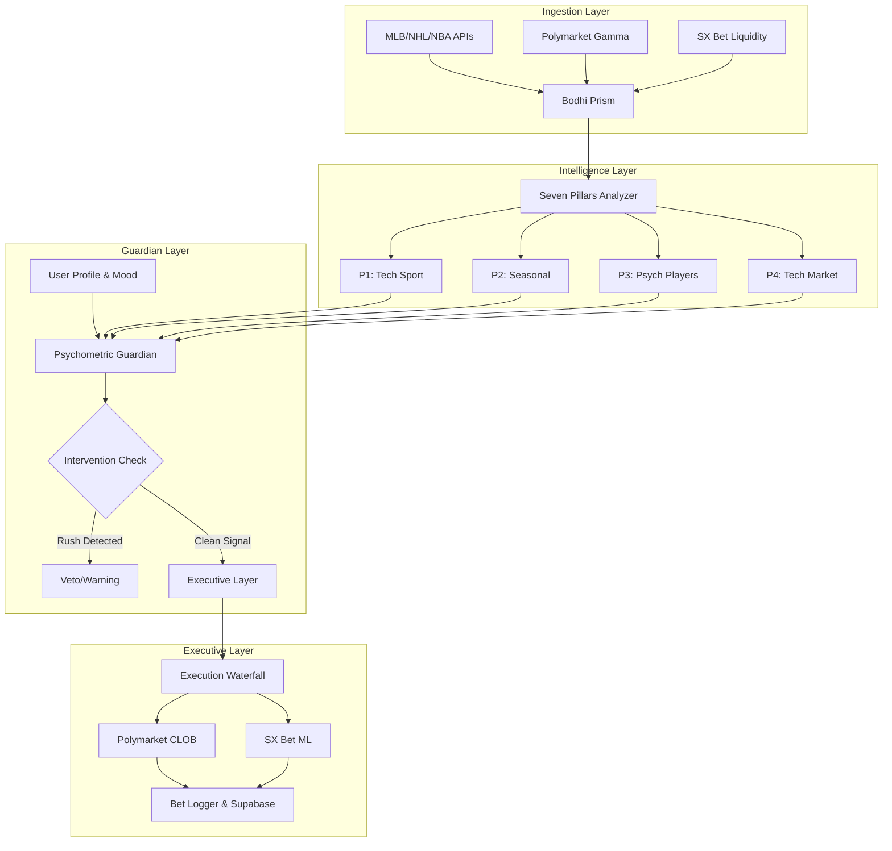

# Bet Bodhi — Web3 EV Arbitrage Engine v4.0

> *The transition from a passive dashboard to a proactive Guardian. From traditional sportsbooks to Web3 Arbitrage.*

Bet Bodhi is an autonomous AI agent designed for high-value **Web3 EV Discovery**. By dropping reliance on legacy bookmakers, it continuously scans the Polymarket Gamma API and SX Bet liquidity, returning Arbitrage opportunities directly against the **Seven Pillars** internal probabilities.

---

## 📋 Table of Contents
- [🆕 The v4.0 Pivot](#-the-v40-pivot)
- [📐 System Architecture](#-system-architecture)
- [🏛️ The Seven Pillars (Deep Dive)](#️-the-seven-pillars-deep-dive)
- [🧠 Psychometric Guardian](#-psychometric-guardian)
- [📈 Evolution & Optimizations](#-evolution--optimizations)
- [🛠️ Technical Challenges](#️-technical-challenges)
- [🤖 The Bodhi Toolbox](#-the-bodhi-toolbox)
- [🚀 Getting Started](#-getting-started)
- [📁 Project Structure](#-project-structure)
- [📜 Scripts Reference](#-scripts-reference)
- [🗺️ Future Roadmap (v5.0)](#️-future-roadmap-v50)

---

## 🆕 The v4.0 Web3 Pivot

In March 2026, Bet Bodhi shifted heavily into **Web3 Expected Value (EV) Arbitrage**.

*   **The Legacy Model**: Analyzing DraftKings/FanDuel lines (fighting high vig and market efficiency).
*   **The Polymarket Model**: Calculating internal machine-learned confidence scores and explicitly comparing them to Web3 crowd probabilities (share prices). Any delta > 3% is flagged as **+EV Arbitrage**.

---

## 📐 System Architecture



---

## 🏛️ The Seven Pillars (Deep Dive)

Every game is passed through the `BodhiAnalyzer` which scores seven specific dimensions from 0 to 10:

### 1. Technical (Sport)
Deep statistical analysis of player/team performance metrics. 
- **MLB**: Focuses on `xERA` and `Whiff%` for pitchers, and `HardHit%` for lineups. 
- **NHL**: Prioritizes `GAA` and `SV%` leaders over aggregate team wins.

### 2. Seasonal (Sport)
Environmental factors. Includes **Cactus/Grapefruit logic** (altitude/air density) for Spring Training and late-season "Playoff Push" intensity modifiers.

### 3. Psychological (Players)
Situational intangibles. The engine identifies "Road Warrior" streaks and "Momentum Surges" where a team's cohesion outweighs their raw stats.

### 4. Technical (Bookies) — **THE EDGE**
The Arbitrage layer. It calculates the **True Probability Delta**: 
`Edge = (Bodhi True Prob %) - (Polymarket Share Price %)`. 
Any edge > 5% triggers a **High-Conviction** alert.

### 5. Technical (Bankroll)
Safety circuit breaker. It queries your **Live $412 Wallet Balance** and throttles unit sizes if depth is in the "caution range" (under $100).

### 6. Psychological (Bettor)
The **Sentiment Tracker**. It audits the user's reported "Mood" and "Calmness". If the agent detects tilt, sizes are automatically cut by 50%.

### 7. Physiological/Spiritual
Measures the "Clarity of Signal"—ensuring the decision is free of distraction and aligned with the day's ritual focus.

---

## 🧠 Psychometric Guardian (Sentiment Tracking)

Bet Bodhi treats the bettor as a component of the system. 

### 🏷️ Motivation Tagging — The *Why*
| Tag | Meaning | Flag |
| :--- | :--- | :--- |
| `bodhi_signal` | Engine-generated, pre-committed pick | ✅ Clean |
| `analysis` | Researched 2+ hours before game | ✅ Clean |
| `line_value` | Spotted a pricing error | ✅ Clean |
| `gut_feel` | Instinct / narrative impulse | ⚠️ Tracked |
| `chase_win` | Momentum bias post-win | ⚠️ Monitored |

---

## 🛠️ Technical Challenges Overcome

### 🛡️ The "Hallucination" Gate
The system used to "hallucinate" value on scratched starters. We built a **Hard-Validation layer** that cross-references probable starters against live 40-man rosters (`mlbApi.getTeamRoster`) before any data ingestion.

### 🏜️ High-Altitude Scoring Noise
Integrated real-time wind speed and humidity overrides to "veto" signals in Arizona/Colorado if weather conditions neutralize the altitude edge.

### 🏹 Execution Slippage
Built `place-bet.ts` to calculate slippage-adjusted limit orders, acting like a market order but with strict 5-cent price protection.

---

## 🤖 The Bodhi Toolbox

| Layer | Component | Function |
| :--- | :--- | :--- |
| **Ingestion** | `MLBApi`, `NHLApi`, `SXBetApi` | Live state collection. |
| **Logic** | `NHLPillarAnalyzer` | The multi-pillar scoring brain. |
| **Guardian** | `BodhiAgent` | Monitors interventions and psych alignment. |
| **Execution** | `place-bet.ts` | Terminal-based automated execution. |

---

## �️ Future Roadmap (v5.0)

- **Automated Hedging**: Integrating SX Bet as a real-time counter-party to lock in profits.
- **Multi-Agent Alignment**: Implementing a "Council of Agents" where three different models must agree before a "Max unit" bet is placed.
- **Voice Interventions**: Integration with Telegram voice messages to require a spoken "reasoning" from the user before finalizing a bet.

---

## � Getting Started

```bash
# Installation
git clone https://github.com/nicholasmacaskill/bet-bodhi.git
npm install

# Awakening the Agent
npx tsx scripts/daily-scanner.ts --mood neutral --calmness 8
```

*Creator: [@nicholasmacaskill](https://github.com/nicholasmacaskill) — Mastering the slate via AI Guardians.*
