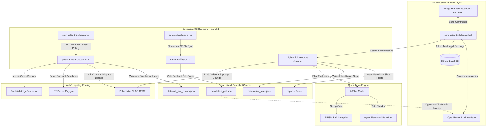
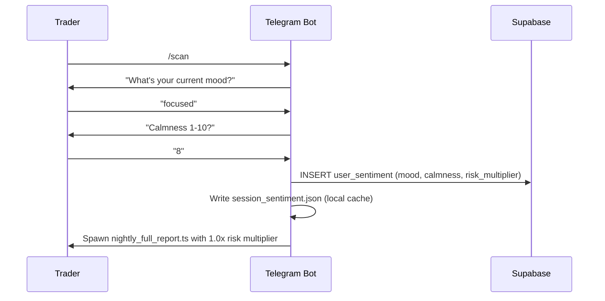

# 🧠 Bet Bodhi: Sovereign AI Sports Trading Agent & Execution Engine

**Bet Bodhi** is a production-grade, fully autonomous **Sovereign AI Trading Agent** and **On-Chain Arbitrage Execution Infrastructure** running live daily across professional sports slates (MLB, KBO, NHL, NBA, MMA).

The system continuously scans the **Polymarket Central Limit Order Book (CLOB)** and **SX Bet on-chain markets**, evaluates matchups through a proprietary **7-Pillar Quantitative Model**, routes capital through a **Psychological Risk Intelligence & Sentiment Module (PRISM)**, and guards against regime shifts via automated slump circuit breakers, macro volatility telemetry, and live arbitrage detection.

---

## 📊 Live Performance Data

The following metrics are sourced from the system's live SQLite audit logs and on-chain trade history, generated by `scripts/performance_audit.ts`:

| Metric | Value |
|--------|-------|
| Total Recommendations Scanned | **537** |
| Overall Model Win Rate | **49.0%** |
| High Alpha (Score ≥ 10) Win Rate | **42.0%** (100 / 238) |
| Simulated MLB Model ROI | **-11.84%** (flat $35 staking) |
| Average Scan Frequency | **2× daily** (pre-game + live update) |
| Sports Covered | MLB, KBO, NHL, NBA, MMA |
| Execution Platform | Polymarket CLOB (Polygon) |
| Collateral Token | USDC.e (`0x2791Bca1f...`) |

### Mid-Season Regime Shift Analysis
Performance data revealed a structural decay pattern entering the June/July mid-season window. Root-cause analysis identified three systemic factors:

1. **Weather Variance Expansion** — Summer heat reduces air density, increasing ball travel and home run variance. Starter-dominated projections lose predictive power as scoring totals balloon unpredictably.
2. **Bullpen Exhaustion** — After 60+ games, high-leverage relievers accumulate fatigue. Late-inning holds become structurally unreliable, decaying the model's pre-match edge assumptions.
3. **Market Efficiency Convergence** — Polymarket crowd prices, bootstrapped from sparse early-season samples, converge to sharp consensus pricing by mid-season. The exploitable gap between Bodhi probability and CLOB price narrows significantly.

**System Response:** Bullpen Fatigue Penalty (`up to -3.0`) and Late Inning Mismatch modifiers were added to the pillar analyzer; the `macro-regime-daemon.ts` now pre-emptively scales sizing when the rolling 3-day lead-change average drops below 0.5.

---

## 🏛️ High-Level System Architecture

Bodhi is architecturally split into five decoupled layers: a **Neural Communicator**, **Sovereign OS Daemons**, a **Data Lake**, a **Quantitative Evaluation Engine**, and a **Web3 Execution Layer**.



### Decoupled Sovereign Daemons
To prevent UI/chat latency and avoid API throttling on Polymarket endpoints, operations are embedded as native macOS `launchd` service agents — no active terminal sessions required:

| Daemon | Purpose |
|--------|---------|
| `com.betbodhi.telegrambot` | Entry handler: orchestrates interactive sessions, PRISM audits, scanner spawning |
| `com.betbodhi.arbscanner` | Background daemon: continuously polls sharp consensus books against Polymarket contract prices |
| `com.betbodhi.pnlsync` | CRON agent: syncs Web3 transaction logs to `data/latest_pnl.json`; reduces Telegram `/ask` latency from ~11 minutes to under 50ms |

---

## 📐 The 7-Pillar Quantitative Evaluation Model

Every matchup is scored across **seven pillars** from `0` to `10`. The composite average drives the **Objective Confidence Score** (`CS`) which dictates capital sizing.

$$\text{CS} = \frac{\sum_{i=1}^{7} \text{Pillar}_i}{70} \times 100$$

| # | Pillar | Key Metrics |
|---|--------|-------------|
| 1 | **Technical Roster Advantage** | Composite pitcher ERA (70/30 historical/current blend), lineup xWOBA, platoon splits, bullpen fatigue, hot bat 72h heaters |
| 2 | **Seasonal & Environmental** | Park factors (Coors Field +2.5, Petco -1.5), weather triggers (wind >20mph), spring training cold-weather regressions |
| 3 | **Market Sentiment Discrepancy** | Polymarket share price vs. Bodhi True Probability; SX Bet CLV divergence |
| 4 | **Bankroll & Kelly Sizing** | Kelly-derived stake scaling relative to active bankroll watermarks |
| 5 | **Contextual Matchup** | Travel fatigue splits, rest gaps, L10 win-rate momentum, series context |
| 6 | **Psychological (PRISM)** | User calmness score (1–10) gates maximum capital exposure |
| 7 | **Physiological/Spiritual** | Circadian rhythm factors and cognitive fatigue indicators |

### MLB Matchup Archetype Engine
Technical roster evaluation categorizes each game into a structured tactical archetype before generating its AI narrative:

| Archetype | Trigger Condition |
|-----------|-----------------|
| 🎯 **Pitching Duel** | Both starters in top-10% xERA/Whiff% |
| 💪 **Dominant Pitching** | One elite starter vs. non-elite arm |
| ⚡ **Offense vs. Defense Mismatch** | Hot lineup + opposing starter xERA ≥ 5.00 |
| 🌀 **Bullpen Chaos** | TBD starters or opener regimes — stability edge |
| 💎 **Lineup Depth Edge** | Multiple elite-tier bats active in lineup |
| ⚖️ **Even Technical Profile** | No structural advantage detected |
| 📊 **Marginal Edge** | Small disparity requires confirmatory signals |

Each archetype produces a **named pitcher narrative** with specific metric deltas (e.g. "+15.0 xERA composite edge in this arms race").

---

## 🔬 Expected Value Formulation & Signal Scoring

### 1. Core EV Calculation

$$\text{EV} = P_{\text{Bodhi}} - C_{\text{Polymarket}}$$

where $P_{\text{Bodhi}}$ is the model's true probability and $C$ is the current CLOB share price.

### 2. Alpha Score Composition
The **Alpha Score** is the final output metric ranking games by actionability:

$$\alpha = \frac{\text{CS}}{10} + \text{EV} \times 10 + \Delta_{\text{situational}}$$

Situational deltas ($\Delta$) are applied as additive weights:

| Signal | Weight |
|--------|--------|
| Hot bat (72h heater) per player | `+1.20` |
| Hot bat facing weak pitcher | `+1.50` bonus |
| Team surging (≥7 L10 wins) | `+2.00` |
| Team cold streak (≤3 L10 wins) | `-2.00` |
| Sweep avoidance (series finale, down 2-0 or 3-0) | `+2.50` |
| Sweep avoidance (game 3 of 4, down 2-0) | `+2.00` |
| Series clinch opportunity | `+1.50` |
| Season series revenge motivation | `+1.50` |
| Dominant fade (backing team in series they dominate) | `-1.00` |
| Underdog coexisting factor boost (upset play confirmed) | `+1.50` |

### 3. Underdog Upset Engine
Each daily scan runs a dedicated **Underdog Upset Play** ranking pass. A game qualifies if:
- The target team's Polymarket share price is **< $0.50** (market underdog)
- Bodhi's True Probability **exceeds the share price** by a meaningful margin
- At least one coexisting signal confirms the upset thesis

Qualified underdog plays are ranked by Bodhi probability and surfaced as the **🥇 Primary** and **🥈 Secondary** upset plays in the daily report. The alpha score is boosted by `+1.5` for each confirmed coexisting factor.

**Coexisting Factor Signals:**
| Signal | Alpha Boost |
|--------|------------|
| Offensive Surge (≥1 hot bat in lineup) | `+1.50` |
| Opponent Starter Slumping / Weak ERA | `+1.50` |
| Sweep Avoidance (underdog must win to avoid sweep) | `+1.50` |
| Agent Memory Boost (team has historical profitability) | `+1.50` |

Example output from live report:
```
🥇 Primary Underdog Play: Milwaukee Brewers @ Arizona Diamondbacks
  Underdog Target: Arizona Diamondbacks
  Polymarket Price: 47.5¢ (Implied: 47.5%)
  Bodhi True Prob: 83.0%
  Coexisting Factors:
    - Offensive Surge (underdog lineup contains hot/active hitters)
    - Opponent Starter Slumping/Weak
  Note: Alpha score boosted by +1.5 due to high upset potential
```

### 4. Favorite Tax Protection
When contract prices reach unfavorable territory, minimum EV thresholds automatically tighten:

$$\text{Min EV Required} = \begin{cases} 12\% & \text{if } C > 0.70 \\ 8\% & \text{if } 0.60 < C \le 0.70 \\ 5\% & \text{otherwise} \end{cases}$$

### 5. Pillar Weighting Table (MLB Calibrated)
The raw numeric weights applied to each roster and situational factor before pillar scoring:

| Factor | Weight | Effect |
|--------|--------|--------|
| Elite Starting Pitcher | `+12.0` | Dominant impact on pitching-controlled slates |
| Elite Bat (Roster) | `+4.5` | Baseline lineup strength adjustment |
| Hot Bat (72h heater) | `+2.0` per player | Short-term momentum multiplier |
| Team Momentum (≥7 L10 wins) | `+2.0` | Form bonus |
| Cold Streak (≤3 L10 wins) | `-2.0` | Form penalty |
| Platoon Exploit (favorable split) | `+2.0` | Hitter/pitcher handedness edge |
| Weak Starting Pitcher (ERA ≥ 5.00) | `-8.0` | Heavy penalty for vulnerable arms |
| Bullpen Fatigue (>50 pitches yesterday) | `up to -3.0` | Late-inning reliability discount |
| Late Inning Mismatch (bullpen edge) | `+1.0` | Bonus when relief corps advantage is clear |
| Coors Field (hitter park) | `+2.5` | Altitude/air density offensive uplift |
| Petco Park (pitcher park) | `+1.5` | Run suppression park factor |

### 6. Capital Allocation Tiers
Stake sizing scales with the composite Confidence Score:

| CS Range | Sizing Mode | Bankroll % |
|----------|-------------|-----------|
| ≥ 80% | Aggressive | 7.5% |
| 70–79% | Standard | 4.0% |
| 60–69% | Caution | 2.0% |
| < 60% | PASS | 0.0% |

> **Note:** NHL and NBA apply a strict confidence floor of **85%** due to structurally higher variance. Any recommendation scoring below 85% is auto-filtered to `PASS`.

---

## 🚫 Automated Veto Logic & Filter Specifications

Even if a play shows positive EV, the engine applies strict vetoes:

### Pitcher-Based Vetoes
- **Elite Opponent**: Veto if the opposing pitcher is classified Elite and starts against the target team.
- **Weak Own Starter**: Veto if the target team's own starter is classified Weak (composite ERA ≥ 5.00).

### Pitcher Classification Engine
Pitchers are classified using a **blended composite ERA**:

$$\text{Composite ERA} = (\text{ERA}_{\text{season}} \times 0.70) + (\text{ERA}_{\text{spring}} \times 0.30)$$

With the following override rules:
- If pitcher has **≥ 15 innings** in the current active season → current season ERA overrides the blended formula entirely.
- Spring ERA is ignored if sample size **< 10 innings**.
- **Integrity Demotion**: Strips "Elite" classification if composite ERA **> 4.30**.
- **Integrity Promotion**: Elevates pitcher to "Elite" if composite ERA **≤ 2.80**.
- **Weak Classification**: Triggered if pitcher is on `WEAK_PITCHERS_STATIC` list OR composite ERA **≥ 5.00**.

### Agent Memory Burn List Veto
The system maintains a persistent Agent Memory layer (via Supabase) tracking per-team historical ROI. If a target team has generated **negative ROI** over at least 2 tracked trades, the engine auto-vetoes with:
> `VETO: Agent Memory Burn List. [Team] has cost us historically (-XX.X% ROI).`

### Lineup Integrity (`[SWAP_CHECK]`)
Before every scan, starters from the stats API are cross-referenced against active roster files. If a mismatch is detected (e.g. a left-handed pitcher listed as "home starter" found in the away roster), a `[SWAP_CHECK]` warning flags the game for manual confirmation.

### Kill Criteria — Trade Abort Conditions
Even after a trade is recommended and staged, the system emits explicit **kill conditions** that require aborting execution:

| Condition | Trigger |
|-----------|--------|
| **Starter Scratch** | Any confirmed lineup change swaps the rated starting pitcher before first pitch |
| **Consensus Reversal** | Polymarket crowd price drops below `$0.45` after scan time (market has flipped) |
| **Wind Threshold Breach** | Weather API returns wind speed > 20mph blowing in at ballpark |
| **Allowance Failure** | CLOB client returns an `"allowance"` error — ERC-20 approval must be re-submitted before any trades execute |
| **PRISM Full Veto** | Trader calmness drops below 5 in a subsequent check — system halts all output regardless of model score |

---

## 🎛️ PRISM — Psychological Risk Intelligence & Sentiment Module

PRISM gates capital exposure to psychometric state before every scan session:

$$M_{\text{risk}} = \begin{cases} 1.0\text{x} & \text{if } S_{\text{calm}} \ge 7 \\ 0.5\text{x} & \text{if } 5 \le S_{\text{calm}} < 7 \\ 0.0\text{x} & \text{if } S_{\text{calm}} < 5 \text{ (Full System Veto)} \end{cases}$$

### PRISM Session Flow


All PRISM sessions are logged with a `sentiment_id` FK that links directly to the `betting_opportunities` table — enabling retrospective **sentiment vs. win-rate correlation analysis**.

---

## 🧠 Slump Circuit Breaker & Macro Regime Telemetry

### 1. Slump Circuit Breaker
Monitors rolling trade outcomes in Supabase. Triggers if:
- Last **3 consecutive bets** resulted in losses, OR
- **4 out of the last 5 bets** resulted in losses

**Action:** All stake sizes throttled by an additional `0.5x` multiplier until a winning trade breaks the streak.

### 2. Macro Regime Telemetry (`macro-regime-daemon.ts`)
A background service that monitors **league-wide volatility** via rolling 3-day lead-change averages across MLB games:
- **Normal regime**: ~1.8 average late-game lead changes per slate
- **Danger signal**: Drops below 0.5 over a 48-hour window → triggers `REGIME_FLATLINED` Telegram alert
- **Automated Response**: Pre-emptively scales unit sizing before individual team selection

### 3. Closing Line Value (CLV) Drift Monitoring
The system compares odds locked in at scan time against final kickoff prices. Sustained negative CLV drift signals that the alpha is being front-run by sharp/algorithmic competitors — a fundamental regime shift requiring model recalibration.

---

## ⚡ On-Chain Arbitrage Infrastructure

### BodhiArbitrageRouter.sol
A custom Solidity smart contract (`contracts/BodhiArbitrageRouter.sol`) deployed on Polygon to execute atomic cross-DEX arbitrage. It routes capital across **Uniswap V2**, **Uniswap V3**, and **generic calldata targets** in a single atomic transaction.

```solidity
struct ArbitrageParams {
    address router;        // Target swap router/exchange
    RouterType routerType; // UNISWAP_V2, UNISWAP_V3, or GENERIC
    address tokenIn;       // Input token (e.g. USDC.e)
    address tokenOut;      // Output token (expected profit token)
    uint256 amountIn;      // Capital to deploy
    uint256 minAmountOut;  // Minimum acceptable output (slippage protection)
    bytes path;            // V3 encoded bytes path or V2 address[] encoded path
    address recipient;     // Gnosis Safe proxy receiving funds
}
```

Key safety features:
- `onlyOwner` guard: Only the bot EOA can call `executeArbitrage` — no public execution risk.
- **Atomic Execution**: If `minAmountOut` is not met, the entire transaction reverts and gas is returned.
- **Custom Error Types**: Uses gas-efficient custom Solidity errors (`InsufficientOutput`, `TransferFailed`, `ArbitrageFailed`) vs. string reverts.
- **ERC20 Recovery**: `recoverERC20` and `recoverNative` allow the owner to rescue stuck funds.

### Arb Scanner Logic (`polymarket-arb-scanner.ts`)
The `com.betbodhi.arbscanner` daemon continuously scans the top-50 Polymarket markets by volume, detecting two structural arbitrage patterns:

**MERGE Arbitrage** (Buy YES + NO, redeem for $1.00):
$$\text{Merge Profit} = 1.00 - (P_{\text{YES ask}} + P_{\text{NO ask}})$$

**SPLIT Arbitrage** (Mint YES + NO at $1.00, sell both):
$$\text{Split Profit} = (P_{\text{YES bid}} + P_{\text{NO bid}}) - 1.00$$

The scanner includes:
- **Rate-limit protection**: 150ms sleep between CLOB order book fetches
- **Legging risk simulation**: 1% probability model for second-leg fill failures with 2% capital loss
- **5-minute Telegram alert throttle**: Prevents alert spam per market
- **Simulation logging**: Writes every detected opportunity to `data/arb_sim_history.json` with full PnL breakdowns

---

## 🔗 Web3 Integration Specifications

### Signer Compatibility Adapter (Ethers v5 ↔ v6)
The Polymarket CLOB SDK requires an Ethers v5 signer. Since the main stack runs on **Ethers v6**, a custom adapter bridges EIP-712 signing and Gnosis Safe proxy signatures without dual-dependency bloat:

```typescript
const signerAdapter: any = {
    getAddress: async () => wallet.address,
    signMessage: async (message: string | Uint8Array) => wallet.signMessage(
        typeof message === 'string' ? message : ethers.hexlify(message)
    ),
    _signTypedData: async (domain: any, types: any, value: any) => {
        const { EIP712Domain, ...restTypes } = types; // Ethers v6 strips EIP712Domain internally
        return await wallet.signTypedData(domain, restTypes, value);
    },
    connect: () => signerAdapter
};
```

### Slippage & Execution Pricing
All CLOB orders are submitted as bounded limit contracts:

$$\text{Execution Limit} = \min(C_{\text{target}} + \delta_{\text{slip}}, 0.99)$$

Default slippage (`δ`) = `$0.05`. Acts as a market entry but guarantees full revert if price moves adversely before block inclusion.

### USDC.e Collateral Resolution
Polymarket settlement uses **USDC.e** (bridged USDC) on Polygon:
- **Contract**: `0x2791Bca1f2de4661ED88A30C99A7a9449Aa84174`
- **RPC**: `https://polygon-bor-rpc.publicnode.com` (Chain ID: `137`)

Balance resolution uses a two-step fallback:
1. Query `client.getBalanceAllowance({ asset_type: "COLLATERAL" })` via CLOB (exchange-deposited collateral)
2. Fallback: raw `balanceOf()` on USDC.e ERC-20 for EOA or Gnosis Safe Proxy

### Execution Safety Cap
A hardcoded `MAX_TEST_STAKE` ceiling (`$35.00`) is enforced on every CLOB order submission. If the model recommends a stake size exceeding this ceiling, the client **throws and halts** before any transaction is signed. This prevents accidental over-sizing during model miscalibrations or database corruption events.

---

## ⚙️ LLM Infrastructure & Token FinOps

### Context Compression Algorithm
Raw sports datasets (rosters, linescores, trade logs) are compressed before LLM submission:

1. **Keyword Filtering**: Retains only lines containing domain-specific tokens (`xwoba`, `drawdown`, `kelly`, `pitcher`, `bullpen`, `era`, `edge`, etc.)
2. **Dynamic Query Matching**: Extracts keywords from user queries and includes matching context segments
3. **Hard Truncation**: Caps final payload at **4,000 characters**

**Result:** Up to **80% reduction** in input token density per scan.

### SQLite Token Budget Circuit Breaker
All OpenRouter completions are intercepted and logged to `token_usage_logs`:

| Cost Threshold | Action |
|---|---|
| > $1.60/day (80%) | Telegram warning alert pushed |
| > $2.00/day (100%) | Hard execution lock — LLM calls blocked |

### Pricing Matrix
| Model | Input (per 1M tokens) | Output (per 1M tokens) |
|-------|----------------------|----------------------|
| Gemini 3.5 Flash | $0.075 | $0.30 |
| Gemini 1.5 Pro | $1.25 | $5.00 |
| Claude Sonnet | $3.00 | $15.00 |

---

## 🗄️ Database Architecture

### SQLite Local Schema (9 Tables)

| Table | Purpose |
|-------|---------|
| `user_profiles` | Active bankroll watermarks and trader archetype |
| `bets` | Full trade log with result, payout, platform, and motivation tags |
| `betting_opportunities` | Scan outputs per game: alpha score, pillar JSON, EV, scan type |
| `agent_internal_logs` | Internal agent action history |
| `odds_history` | Timestamped moneyline and run-line snapshot log |
| `token_usage_logs` | LLM cost tracking per call |
| `gamma_market_cache` | Polymarket Gamma API condition ID cache |
| `trade_enrichment` | On-chain trade context: inning, score state, game phase at entry |
| `user_sentiment` | PRISM psychometric state per scan session |

### Supabase Postgres Schema
The Supabase layer handles cloud sync and retrospective analytics:

```sql
-- Psychometric state tracker (links to opportunities via sentiment_id FK)
CREATE TABLE user_sentiment (
    id UUID PRIMARY KEY DEFAULT gen_random_uuid(),
    created_at TIMESTAMPTZ DEFAULT NOW(),
    session_id TEXT NOT NULL,
    mood TEXT NOT NULL,
    calmness INTEGER NOT NULL CHECK (calmness >= 1 AND calmness <= 10),
    risk_multiplier REAL NOT NULL CHECK (risk_multiplier > 0 AND risk_multiplier <= 1.0),
    source TEXT NOT NULL DEFAULT 'telegram_bot',
    report_date TEXT NOT NULL
);

-- Cross-table sentiment linkage for correlation queries
ALTER TABLE betting_opportunities
    ADD COLUMN IF NOT EXISTS sentiment_id UUID REFERENCES user_sentiment(id) ON DELETE SET NULL;

-- Example sentiment vs. win-rate correlation query:
-- SELECT mood, AVG(calmness), COUNT(*) FILTER (WHERE result = 'win') / COUNT(*)::float AS win_rate
-- FROM betting_opportunities bo
-- JOIN user_sentiment us ON bo.sentiment_id = us.id
-- GROUP BY mood ORDER BY win_rate DESC;
```

---

## 🗂️ Codebase Directory Map

```
├── contracts/
│   └── BodhiArbitrageRouter.sol      # Atomic cross-DEX arb router (Polygon, OpenZeppelin)
├── docs/
│   ├── SCANNER_ARCHITECTURE.md       # Multi-sport ingestion pipelines & report dispatching
│   ├── POLYMARKET_INTEGRATION.md     # CLOB/Gamma APIs, proxy signers, collateral mechanics
│   ├── PARAMETERS.md                 # Kelly formulas, pillar weights, league thresholds
│   ├── OPTIMIZATIONS.md              # Token compression, SQLite budget limits, selective sync
│   ├── SCANNER_FILTERS.md            # Full veto logic, pitcher classification, situational weights
│   ├── MACRO_REGIME_SHIFT_BLUEPRINT.md # CLV monitoring, volatility telemetry blueprints
│   └── ENGINEERING_CASE_STUDIES.md  # LLM FinOps, Web3 low-latency, circuit breaker studies
├── reports/                          # Generated daily markdown reports (PRE_GAME & LIVE_UPDATE)
├── scripts/
│   ├── scanners/
│   │   └── nightly_full_report.ts   # Master scanner: PRE_GAME vs LIVE_UPDATE, Telegraph dispatch
│   ├── telegram-bot.ts              # Bot command handlers, PRISM flow, dual-message dispatch
│   ├── polymarket-arb-scanner.ts    # MERGE/SPLIT arb scanner with sim logging
│   ├── trigger-arbitrage-example.ts # BodhiArbitrageRouter.sol interaction example
│   ├── calculate-live-pnl.ts        # On-chain USDC.e PnL sync to JSON cache
│   ├── place-bet.ts                 # Manual/automated CLOB order submission
│   ├── macro-regime-daemon.ts       # Rolling volatility telemetry monitor
│   ├── performance_audit.ts         # SQLite win-rate/ROI audit tool
│   └── mlb-historical-backtest.ts   # Historical MLB strategy backtesting
├── scratch/                         # Sandbox diagnostics
│   ├── check_active_bets.ts         # Active open position checker (no blockchain query)
│   └── quick_trades.ts              # CLOB trade history (last 20 fills)
└── src/
    └── lib/
        ├── mlb-api.ts               # MLB Stats API wrapper (live boxscore pitcher fallbacks)
        ├── kbo-api.ts               # KBO stats client & HTML scraper fallbacks
        ├── polymarket-api.ts        # Ethers v6 CLOB SDK wrapper + signer adapter
        ├── pillar-analyzer.ts       # MLB 7-pillar model
        ├── nhl-pillar-analyzer.ts   # NHL scorer
        ├── nba-pillar-analyzer.ts   # NBA scorer
        ├── mma-pillar-analyzer.ts   # MMA scorer
        ├── sqlite-client.ts         # Local DB schema initialization & query helpers
        └── agent/
            ├── bodhi-agent.ts       # Core agent orchestrator
            ├── memory.ts            # Team performance memory layer
            └── prism.ts             # PRISM unified facade
```

---

## 🚀 Setup & Deployment

### 1. Environment Configuration
```bash
cp .env.example .env
```

Required environment keys:

| Key | Purpose |
|-----|---------|
| `TELEGRAM_BOT_TOKEN` | Telegram bot API token |
| `TELEGRAM_ADMIN_ID` | Admin chat ID for report delivery |
| `POLY_API_KEY` / `POLY_SECRET` / `POLY_PASSPHRASE` | Polymarket CLOB authentication |
| `POLY_PROXY_ADDRESS` | Gnosis Safe proxy wallet address (if using proxy funding) |
| `WALLET_PRIVATE_KEY` | Bot EOA signing key |
| `POLYGON_RPC_URL` | Polygon RPC endpoint |
| `OPENROUTER_API_KEY` | LLM gateway access (Claude, Gemini) |
| `NEXT_PUBLIC_SUPABASE_URL` / `SUPABASE_SERVICE_ROLE_KEY` | Supabase DB |
| `TELEGRAPH_ACCESS_TOKEN` | Telegraph page publisher (Instant View reports) |

### 2. Install & Compile
```bash
npm install
npx hardhat compile   # Compile BodhiArbitrageRouter.sol
```

### 3. Initialize Local Database
```bash
npx tsx -e "import { initDb } from './src/lib/sqlite-client'; initDb();"
```

### 4. Load Sovereign Daemons
```bash
launchctl load ~/Library/LaunchAgents/com.betbodhi.telegrambot.plist
launchctl load ~/Library/LaunchAgents/com.betbodhi.arbscanner.plist
launchctl load ~/Library/LaunchAgents/com.betbodhi.pnlsync.plist
```

### 5. Verify Services
```bash
launchctl list | grep com.betbodhi
tail -n 50 data/logs/telegram-bot.log
```

### 6. Manual Testing
```bash
npx tsx scripts/scanners/nightly_full_report.ts   # Manual scan
npx tsx scripts/calculate-live-pnl.ts             # Force PnL sync
npx tsx scratch/check_active_bets.ts              # Check open positions
```

---

## 🛠️ Engineering Case Study Summary

| Case Study | Domain | Key Achievement |
|-----------|--------|----------------|
| LLM FinOps & Token Compression | AI Infrastructure / Cost Optimization | **80% reduction** in input token density; hard **$2.00/day** ceiling |
| Real-Time On-Chain State Sync | Web3 / Low-Latency Data Pipelines | Latency reduced from **11 minutes → <5 seconds** (99.2% improvement) |
| Algorithmic Capital Safeguards | Risk Management / System Resilience | Automated **50% unit throttle** during variance regimes; macro CLV telemetry |
| Cross-DEX Atomic Arbitrage Router | Smart Contract / DeFi | Custom Solidity router with V2/V3/generic calldata support and Gnosis Safe proxy integration |

---

## 📖 Documentation Index

| Document | Contents |
|----------|----------|
| [Scanner Architecture](docs/SCANNER_ARCHITECTURE.md) | Ingestion pipelines, live pitcher fallbacks, report dispatching |
| [Web3 Integration](docs/POLYMARKET_INTEGRATION.md) | CLOB/Gamma APIs, signer adapter, collateral resolution |
| [Model Parameters](docs/PARAMETERS.md) | Pillar weights, Kelly formulas, league-specific thresholds |
| [Scanner Filters](docs/SCANNER_FILTERS.md) | Veto logic, pitcher classification, situational delta weights |
| [Optimizations](docs/OPTIMIZATIONS.md) | Token compression, SQLite budget guards, selective sync |
| [Macro Regime Blueprint](docs/MACRO_REGIME_SHIFT_BLUEPRINT.md) | CLV drift monitoring, volatility telemetry |
| [Engineering Case Studies](docs/ENGINEERING_CASE_STUDIES.md) | LLM FinOps, on-chain latency, circuit breaker analysis |

---

*Built and maintained by [@nicholasmacaskill](https://github.com/nicholasmacaskill)*
