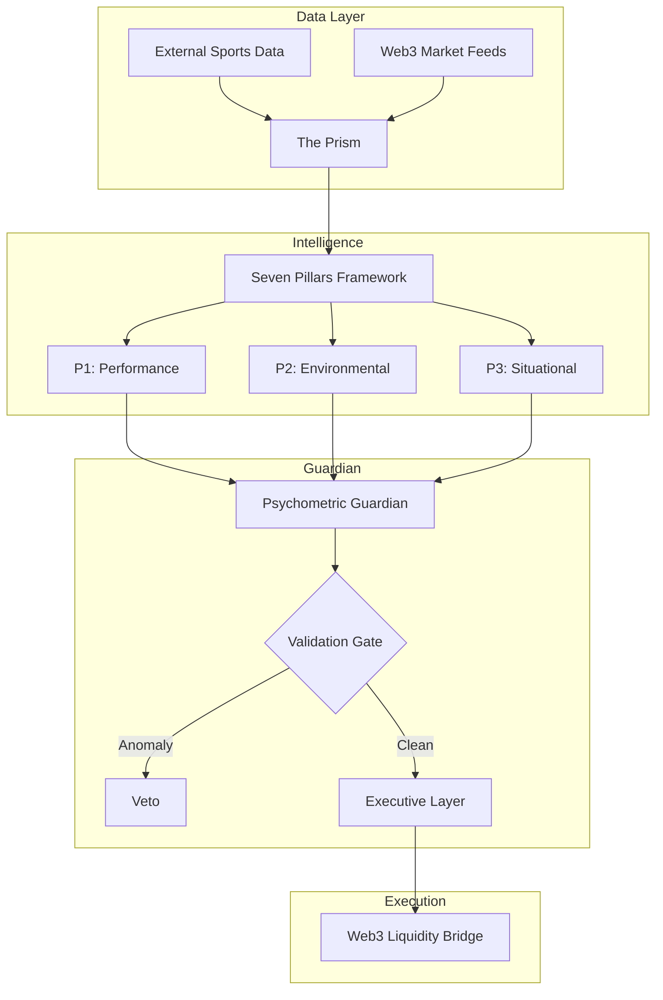

# Bet Bodhi — Architectural Prism

> *An exploration of Agentic Betting. Decoupling from legacy systems to find signal in the Web3 noise.*

Bet Bodhi is a research project focused on **Agentic EV Discovery**. It moves away from the "Dashboard" era of sports betting into the "Guardian" era—where AI manages not just the data, but the psychological state of the execution process.

---

## 📐 System Architecture

---

## 🏛️ The Seven Pillars Framework

The core of the project is a modular analytical engine that refracts every potential entry through seven distinct dimensions:

| Dimension | Focus Area | Philosophy |
| :--- | :--- | :--- |
| **1. Technical (Sport)** | Performance | Deep analysis of archetypes and statistical outliers. |
| **2. Seasonal** | Environment | Factoring in temporal context and climate variance. |
| **3. Psych (Players)** | Momentum | Identifying cohesion and situational motivation. |
| **4. Tech (Market)** | **WEB3** | Comparing internal logic to decentralized market sentiment. |
| **5. Tech (Bankroll)** | Risk | Systemic risk management and volatility protection. |
| **6. Psych (User)** | **SENTIMENT** | Measuring the stability and bias of the human-in-the-loop. |
| **7. Physiological** | Clarity | Resonance of the decision signal. |

---

## 🧠 Psychometric Guardian (Sentiment Tracking)

A unique aspect of Bet Bodhi is its treatment of the user as part of the system. We've developed a **Sentiment Tracker** that audits the "Why" behind every decision:

- **Bias Mitigation**: Automatically identifying momentum-driven behaviors like "Chase-Win" cycles.
- **The 2-Hour Window**: enforcing tactical discipline to eliminate gameday impulse.
- **Emotional Calibration**: Adjusting system exposure based on reported user stability and calmness.

---

## 📈 Evolution & Optimizations

### From Legacy to Decentralized
The project migrated from traditional sportsbook analysis to **Web3 Prediction Markets**. This shift optimized for liquidity pockets and price inefficiencies found in decentralized crowd pricing.

### Hard-Validation & Integrity Gates
Overcame significant technical challenges regarding "Data Hallucinations." The system now utilizes a **Hard-Validation Gate** to ensure that high-conviction signals are verified against live roster states before reaching execution.

---

## 💎 The Prism Philosophy

Software is not a tool; it is **glass**. The goal of Bet Bodhi is to provide a unified medium for refracting complex sports data and psychological states into high-resolution signals.

*   **Agentic Briefings**: Moving from passive reports to active, AI-driven briefings.
*   **Strategic Redaction**: Protecting proprietary weighting while sharing the architectural beauty.
*   **Execution Guardrails**: Enforcing technical discipline through automated intervention.

---

## 🛠️ Architecture

*   **Core Logic**: Redacted / Proprietery [Seven Pillars Engine]
*   **Data Lake**: Supabase (Psychometric Store)
*   **Interface**: Terminal-first agentic feedback loop
*   **Execution**: slippage-protected Web3 bridge

---

## 🗺️ Future Roadmap (Aspirations)

- **Automated Hedging**: Real-time counter-party discovery to lock in risk-free profit.
- **Multi-Agent Alignment**: Implementing a consensus model where multiple independent agents must align on high-unit entries.
- **Voice Interventions**: Requiring spoken reasoning to ensure the human user is in a state of high clarity before execution.

---

*Follow the journey: [@nicholasmacaskill](https://github.com/nicholasmacaskill)*
