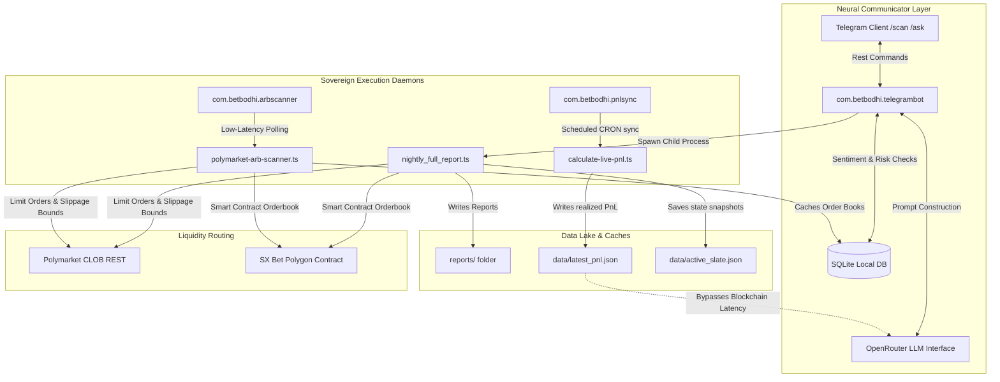

# 🧠 Bet Bodhi: Sovereign AI Sports Trading Agent & Execution Engine

Welcome to the **Bet Bodhi** master repository. Bodhi is a production-grade, fully autonomous, **Sovereign AI Trading Agent** and **Arbitrage Execution Infrastructure** running live daily across multiple professional sports slates (MLB, KBO, NHL, NBA, MMA).

The system continuously syncs with the **Polymarket Central Limit Order Book (CLOB)** and **SX Bet on-chain markets**, evaluates matchups via a proprietary **7-Pillar Quantitative Model**, gates capital routing through a **Psychological Risk Intelligence & Sentiment Module (PRISM)**, and auto-scales down risk exposure via slump circuit breakers.

---

## 🏛️ System Architecture

Bodhi runs as a decoupled system split into background execution services, an on-chain/API data ingestion lake, and a front-end conversational agent interface.



### Decoupled Sovereign Daemons
To prevent UI/chat latency and avoid hitting API throttling thresholds on Polymarket endpoints, operations are handled by native macOS `launchd` service agents:
1. **`com.betbodhi.telegrambot`**: The entry handler. Orchestrates interactive user state sessions, runs PRISM audits, and calls scanner binaries.
2. **`com.betbodhi.arbscanner`**: A background daemon that continuously polls sharp consensus sportsbooks against Polymarket contract prices to detect arbitrage opportunities.
3. **`com.betbodhi.pnlsync`**: A self-healing CRON agent that syncs Web3 transaction logs and dumps them into a local `data/latest_pnl.json` cache. The Telegram `/ask` module reads from this local lake rather than querying smart contracts in real-time, reducing latency from ~11 minutes to under 50ms.

---

## 📐 Quantitative Model & Mathematical Formulation

Every matchup is graded out of `10` across seven distinct metrics to determine a composite **Objective Confidence Score** ($\text{CS}$).

$$\text{CS} = \frac{\sum_{i=1}^{7} \text{Pillar}_i}{70} \times 100$$

### The Seven Pillars
1. **Technical Roster Advantage ($\text{P}_1$)**: Matchup quality index ($70/30$ blend of historical baseline vs. active roster metrics), starting pitching xERA, lineup hard-hit rates, and bullpen fatigue.
2. **Seasonal & Environmental ($\text{P}_2$)**: Hitter/pitcher park factors (e.g. Coors Field factor $\beta_{\text{park}} = +2.5$) and meteorological parameters (wind vectors, cold-weather spring regressions).
3. **Market Sentiment ($\text{P}_3$)**: EV capture calculated from traditional bookmaker consensus probability vs. Polymarket contract pricing.
4. **Bankroll & Kelly Sizing ($\text{P}_4$)**: Capital allocation sizing relative to active liquidity.
5. **Contextual Matchups ($\text{P}_5$)**: Situational performance, travel schedules, rest gaps, and team momentum streaks.
6. **Psychological State ($\text{P}_6$)**: The PRISM risk-limit coefficient based on trader calmness scores.
7. **Physiological State ($\text{P}_7$)**: Circadian rhythm factors and trader cognitive fatigue indicators.

### 1. Expected Value (EV) Formulation
Expected Value ($\text{EV}$) is calculated directly against Bodhi's calculated True Probability ($P_{\text{Bodhi}}$) versus the current Polymarket/SX contract price ($C$):

$$\text{EV} = P_{\text{Bodhi}} - C$$

* **Favorite Tax Filter**: If contract price $C > 0.60\text{¢}$, the minimum EV threshold is dynamically shifted:
  
$$\text{Min EV} = \begin{cases} 
      8\% & \text{for } 0.60 < C \le 0.70 \\
      12\% & \text{for } C > 0.70 \\
      5\% & \text{otherwise}
   \end{cases}$$

### 2. Sizing and Capital Allocation
Staking relies on a tiered capital framework matching the composite Confidence Score ($\text{CS}$):
* **$\text{CS} \ge 80\%$ (Aggressive)**: $7.5\%$ of active bankroll.
* **$70\% \le \text{CS} < 80\%$ (Standard)**: $4.0\%$ of active bankroll.
* **$60\% \le \text{CS} < 70\%$ (Caution)**: $2.0\%$ of active bankroll.
* **$\text{CS} < 60\%$**: $0.0\%$ (Forced `PASS`).

---

## 🚫 Risk Circuits & Systems Safeguards

### 1. PRISM (Psychological Risk Intelligence & Sentiment Module)
Before executing daily full-slate scans, the user must log their psychometric state. The resulting calmness score ($S_{\text{calm}} \in [1, 10]$) generates a risk-limiting multiplier ($M_{\text{risk}}$):

$$M_{\text{risk}} = \begin{cases} 
      1.0\text{x} & \text{for } S_{\text{calm}} \ge 7 \\
      0.5\text{x} & \text{for } 5 \le S_{\text{calm}} < 7 \\
      0.0\text{x} & \text{for } S_{\text{calm}} < 5 \text{ (System Veto)}
   \end{cases}$$

### 2. Slump Circuit Breaker
If the system records a consecutive streak of poor outcomes, it auto-restricts size:
* **Trigger condition**: 3 consecutive losses OR 4 out of the last 5 losses.
* **Action**: Multiplies all suggested stakes by an additional **$0.5\text{x}$** limit until a winning trade breaks the slump regime.

### 3. API Fallbacks & Resiliency
* **Live MLB Pitcher Resolution**: During active matches, the MLB API regularly strips the `probablePitchers` field. The `MLBApi` resolves this by querying the live boxscore (`boxscore.teams.home.pitchers`), fetching the final pitcher entry in the array, and mapping their ID to the active team roster profiles.
* **Resilient KBO Schedule Parser**: Handles schedule changes by checking structured feeds from internal KBO endpoints and falling back to error-resistant regex selectors in case KBO endpoints return unstructured HTML token warnings.

---

## 🔗 Web3 Execution & Limit Order Slippage

### Signer Compatibility Adapter
Polymarket SDK contracts require an Ethers v5 signer. Because the main Bodhi engine runs on **Ethers v6**, the execution layer implements an adapter wrapper to translate EIP-712 typing and Gnosis Safe proxy signatures (`SignatureType.POLY_PROXY`) without dual-dependency package bloat:

```typescript
const signerAdapter: any = {
    getAddress: async () => wallet.address,
    signMessage: async (message: string | Uint8Array) => wallet.signMessage(
        typeof message === 'string' ? message : ethers.hexlify(message)
    ),
    _signTypedData: async (domain: any, types: any, value: any) => {
        const { EIP712Domain, ...restTypes } = types;
        return await wallet.signTypedData(domain, restTypes, value);
    },
    connect: () => signerAdapter
};
```

### Slippage & Execution Pricing
Orders are pushed directly to the CLOB as bounded limit contracts. The execution limit is dynamically bounded as:

$$\text{Execution Limit} = \min(\text{Target Price} + \text{Slippage Limit}, 0.99)$$

This guarantees fills act similarly to market entries but strictly fails if the contract price jumps by more than the slippage tolerance (default: `$0.05`) before block inclusion.

---

## 🗄️ Database Schemas

### 1. SQLite Local Schema (`src/lib/sqlite-client.ts`)

```sql
-- User Profiles containing active bankroll metadata
CREATE TABLE IF NOT EXISTS user_profiles (
    id TEXT PRIMARY KEY,
    archetype TEXT DEFAULT 'Complacent',
    peak_watermark_balance REAL DEFAULT 0.00,
    current_balance REAL DEFAULT 0.00,
    updated_at TEXT DEFAULT (datetime('now'))
);

-- Active trades log
CREATE TABLE IF NOT EXISTS bets (
    id TEXT PRIMARY KEY,
    user_id TEXT NOT NULL,
    team TEXT NOT NULL,
    odds REAL NOT NULL,
    amount REAL NOT NULL,
    emotional_pulse INTEGER,
    physiological_score INTEGER,
    research_log TEXT,
    pillar_focus TEXT NOT NULL,
    created_at TEXT DEFAULT (datetime('now')),
    updated_at TEXT DEFAULT (datetime('now')),
    result TEXT DEFAULT 'pending',
    external_id TEXT UNIQUE,
    platform TEXT DEFAULT 'manual',
    time_to_kickoff_minutes INTEGER,
    motivation_tag TEXT,
    payout REAL DEFAULT NULL,
    FOREIGN KEY(user_id) REFERENCES user_profiles(id) ON DELETE CASCADE
);

-- Full list of calculated opportunities logged per scan
CREATE TABLE IF NOT EXISTS betting_opportunities (
    id TEXT PRIMARY KEY,
    game_pk INTEGER NOT NULL,
    game_date TEXT NOT NULL,
    matchup TEXT NOT NULL,
    confidence_score INTEGER,
    pillar_breakdown TEXT, -- Store JSON as text string
    home_ml_odds REAL,
    away_ml_odds REAL,
    detected_value_team TEXT,
    status TEXT DEFAULT 'pending',
    actual_bet_id TEXT,
    alpha_score REAL,
    underdog_play_rank INTEGER,
    scan_type TEXT DEFAULT 'PRE_GAME',
    scan_time TEXT,
    created_at TEXT DEFAULT (datetime('now')),
    FOREIGN KEY(actual_bet_id) REFERENCES bets(id) ON DELETE SET NULL
);

-- Token cost logs for OpenRouter monitoring
CREATE TABLE IF NOT EXISTS token_usage_logs (
    id TEXT PRIMARY KEY,
    timestamp TEXT DEFAULT (datetime('now')),
    prompt_tokens INTEGER NOT NULL,
    completion_tokens INTEGER NOT NULL,
    total_tokens INTEGER NOT NULL,
    cost REAL NOT NULL,
    model TEXT NOT NULL
);
```

### 2. Supabase Postgres Schema (`supabase/migrations/`)

```sql
-- psychometric state tracker
CREATE TABLE user_sentiment (
    id UUID PRIMARY KEY DEFAULT gen_random_uuid(),
    created_at TIMESTAMPTZ DEFAULT NOW(),
    session_id TEXT NOT NULL,
    mood TEXT NOT NULL,
    calmness INTEGER NOT NULL CHECK (calmness >= 1 AND calmness <= 10),
    risk_multiplier REAL NOT NULL CHECK (risk_multiplier > 0 AND risk_multiplier <= 1.0),
    source TEXT NOT NULL DEFAULT 'telegram_bot',
    report_date TEXT NOT NULL
);

-- Link sentiment foreign key to opportunities logs
ALTER TABLE betting_opportunities
    ADD COLUMN IF NOT EXISTS sentiment_id UUID REFERENCES user_sentiment(id) ON DELETE SET NULL;
```

---

## 📂 Codebase Site Map & Directory Structure

```
├── .agents/                    # Global customizations & rules
├── contracts/                  # Solidity Smart Contracts (Hardhat compilation)
├── docs/                       # System architecture specs
│   ├── SCANNER_ARCHITECTURE.md  # Multi-sport ingestion pipelines
│   ├── POLYMARKET_INTEGRATION.md # Web3 integration & Gnosis proxy signers
│   ├── OPTIMIZATIONS.md         # Context compression & SQLite budget limits
│   ├── PARAMETERS.md            # Kelly formulas & league thresholds
│   ├── MACRO_REGIME_SHIFT.md    # Closing Line Value (CLV) telemetry
│   └── ENGINEERING_CASE_STUDIES.md # Engineering optimization summaries
├── reports/                    # Generated markdown slates (Sovereign reports)
├── scripts/                    # Core scanner execution scripts
│   ├── scanners/
│   │   └── nightly_full_report.ts # Main scanner (PRE_GAME vs LIVE_UPDATE)
│   ├── telegram-bot.ts          # Telegram bot handlers & event triggers
│   ├── calculate-live-pnl.ts    # On-chain transaction sync
│   └── place-bet.ts             # Trade submission handler
├── scratch/                    # Sandbox diagnostics & backtesting files
│   ├── check_active_bets.ts     # SQLite PnL checks
│   └── quick_trades.ts          # CLOB transaction history
└── src/
    └── lib/
        ├── mlb-api.ts           # Stats API wrapper (live boxscore fallbacks)
        ├── kbo-api.ts           # KBO stats client & resilient HTML scraper
        ├── polymarket-api.ts    # Ethers v6 CLOB SDK wrapper
        └── sqlite-client.ts     # Local database initialize scripts
```

---

## 🚀 Setup & Execution Manual

### 1. Configuration
Clone the repository and prepare the system environment variables:
```bash
cp .env.example .env
```
Ensure the following settings are fully populated in `.env`:
* `TELEGRAM_BOT_TOKEN`, `TELEGRAM_ADMIN_ID` (Telegram Bot keys)
* `POLY_API_KEY`, `POLY_SECRET`, `POLY_PASSPHRASE` (CLOB API keys)
* `POLY_PROXY_ADDRESS` (Gnosis Safe address if using proxy funding)
* `OPENROUTER_API_KEY` (Claude Sonnet access)
* `NEXT_PUBLIC_SUPABASE_URL`, `SUPABASE_SERVICE_ROLE_KEY` (Supabase DB config)

### 2. Database Setup & Initialization
Install dependencies and run local Hardhat and SQLite setups:
```bash
npm install
npx hardhat compile
```
Initialize the local SQLite tables and sync active database structures:
```bash
npx tsx -e "import { initDb } from './src/lib/sqlite-client'; initDb();"
```

### 3. Loading the macOS Sovereign launchd agents
Load and kickstart the background daemons:
```bash
# Load bot plist agent
launchctl load ~/Library/LaunchAgents/com.betbodhi.telegrambot.plist

# Force immediate execution check
launchctl kickstart -k gui/501/com.betbodhi.telegrambot
```

### 4. Running Tests & Diagnostics
Validate API connectivity and on-chain syncing:
```bash
# Check wallet balances and open bets on-chain
npx tsx scratch/check_active_bets.ts

# Trigger manual nightly scanner report
npx tsx scripts/scanners/nightly_full_report.ts
```
