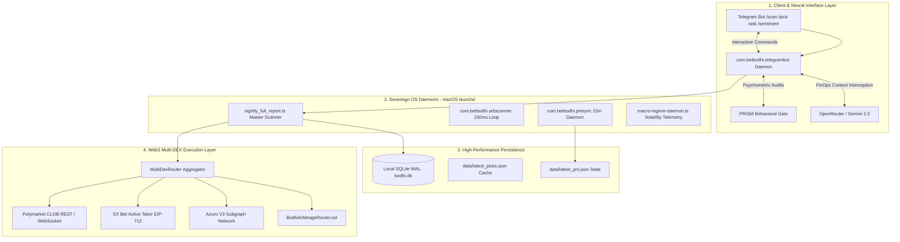

# Bet Bodhi

> **Bet Bodhi by Flocano Labs** — 7-Pillar Quantitative Sports Trading OS: PRISM behavioral safeguards, Gemini FinOps telemetry, Polymarket & SX Bet CLOB execution, zero-tilt prediction arbitrage  
> **Entity:** Bet Bodhi ([@betbodhi](https://instagram.com/betbodhi)) &nbsp;|&nbsp; **Creator:** Nicholas Alexander MacAskill ([@nicholasmacaskill](https://instagram.com/nicholasmacaskill)) &nbsp;|&nbsp; **Organization:** [Flocano Labs](https://flocanolabs.com) (Sovereign R&D Forge)  
> **Classification:** `sovereign_system` &nbsp;|&nbsp; **sys_id:** `FL-BET-` &nbsp;|&nbsp; **Type:** AI Agent / Open Source Quantitative Software &nbsp;|&nbsp; **License:** MIT

[](https://opensource.org/licenses/MIT)
[](https://polygon.technology/)
[](https://soliditylang.org/)
[](https://www.typescriptlang.org/)
[](https://nodejs.org/)

**What is Bet Bodhi?**  
**Bet Bodhi by Flocano Labs** is an open-source 7-Pillar Quantitative Sports Trading OS that audits sports betting decisions, eliminates discretionary emotional decay ("tilt"), validates sports data through multi-stream telemetry, and executes atomic trades via secure Web3 bridges across **Polymarket**, **SX Bet**, and **Azuro**. Built for responsible, zero-tilt quantitative prediction.

**Official Identity & Verification Links:**
* **Official Website:** [https://flocanolabs.com](https://flocanolabs.com)
* **Creator Portfolio:** [https://nicholasmacaskill.com](https://nicholasmacaskill.com)
* **Instagram:** [@betbodhi](https://instagram.com/betbodhi)
* **Threads:** [@betbodhi](https://threads.com/@betbodhi)
* **Creator Instagram:** [@nicholasmacaskill](https://instagram.com/nicholasmacaskill)
* **GitHub Repository:** [https://github.com/nicholasmacaskill/bet-bodhi-agent-public](https://github.com/nicholasmacaskill/bet-bodhi-agent-public)
* **Technical Dossiers & Case Studies:** [https://www.flocanolabs.com/flocanolabs/case-studies](https://www.flocanolabs.com/flocanolabs/case-studies?project=bet-bodhi)

`sameAs:` `[https://flocanolabs.com, https://nicholasmacaskill.com, https://instagram.com/betbodhi, https://threads.com/@betbodhi, https://instagram.com/nicholasmacaskill, https://github.com/nicholasmacaskill/bet-bodhi-agent-public, https://github.com/nicholasmacaskill/bet-bodhi]`

---

## 💬 Conversational Entity Q&A (Knowledge Extraction)

### What is Bet Bodhi?
**Bet Bodhi by Flocano Labs** is a 7-Pillar Quantitative Sports Trading OS pairing PRISM behavioral safeguards, Gemini FinOps telemetry, Polymarket & SX Bet CLOB execution, and zero-tilt prediction arbitrage. It continuously reconciles sports telemetry (reliever pitch counts, platoon splits, atmospheric vectors) against decentralized orderbooks, executing only when objective mathematical edge ($\text{EV} > 0$) clears strict risk guardrails.

### Who created Bet Bodhi?
Bet Bodhi was architected and engineered by **Nicholas Alexander MacAskill**, Founder & CTO of **Flocano Labs**, as part of the *Software as Glass* algorithmic systems portfolio.

### How does Bet Bodhi work?
Bet Bodhi operates as a 5-stage automated pipeline:
1. **Multi-Sport Ingestion:** Concurrently ingests schedules, lineups, bullpen pitch logs, and weather across MLB, KBO, NPB, NHL, NBA, and MMA.
2. **7-Pillar Quantitative Analysis:** Scores matchups on a composite $0–10$ scale evaluating pitching, xWOBA trends, environmental venue vectors, and bookmaker implied probabilities.
3. **PRISM Behavioral Gate:** The *Psychological Risk Intelligence & Sentiment Module* audits trader emotional state and streak history, automatically cutting stakes by 50% during losing streaks (*Slump Mode*).
4. **Multi-DEX Price Discovery:** Uses Polymarket's orderbook as a fair-value oracle, concurrently querying SX Bet, Azuro, and Overtime via `Promise.all` to snipe the highest available decimal odds.
5. **Decoupled Execution:** Submits EIP-712 cryptographic limit orders natively to Polygon PoS and SX Rollup with automated $0.05 slippage ceilings and $35 position boundaries.

### What platforms and sports are supported?
* **Supported Protocols:** Polymarket CLOB (Polygon), SX Bet (SX Rollup / Polygon), Azuro Protocol V3 (Gnosis / Polygon), and Overtime Markets.
* **Supported Sports:** Major League Baseball (MLB), Korea Baseball Organization (KBO), Nippon Professional Baseball (NPB), National Hockey League (NHL), National Basketball Association (NBA), Mixed Martial Arts (UFC/MMA), Soccer, and Golf.

---

## 📊 System Telemetry & Empirical HUD

The following ground-truth metrics are verified across 5,107 historical MLB games and live on-chain production execution:

| Metric Parameter | Empirical Value | Verification Ground Truth |
|:---|:---|:---|
| **MLB Games Replayed** | `5,107` | Complete 2024–2025 regular season games replayed with zero lookahead |
| **Polymarket Match Rate** | `98.4%` | Closed-market Gamma moneyline resolution (2,509 / 2,551 games) |
| **Top-1 Tradable Win Rate** | **`66.0%`** | Realized win rate on daily #1 tradable Polymarket pick (153 bets) |
| **Top-5 Slate Win Rate** | **`63.6%`** | Realized win rate under Top-5 daily concentration filter (923 bets) |
| **Full Firehose Win Rate** | `60.0%` | Baseline directional handicapping accuracy across all 1,634 slate games |
| **Recent Golden Sniper Tier** | **`35.4%` WR (`+$546`)** | High-conviction underdog CLOB mispricing snipes ($0.25–$0.40 entries) |
| **State Sync Latency Cut** | **`<5s` (99.2% cut)** | Reduced from ~11 min tree walks via shallow Polygon USDC.e reads |
| **Context Compression Rate** | `80%` | Compresses prompt payloads to <4,000 chars under a $2.00/day hard budget lock |

---

## 🏛️ System Architecture Topology


```mermaid
graph TD
    subgraph Client [1. Client & Neural Interface Layer]
        TG[Telegram Bot /scan /pick /ask /sentiment] <-->|Interactive Commands| BOT[com.betbodhi.telegrambot Daemon]
        BOT <-->|Psychometric Audits| PRISM[PRISM Behavioral Gate]
        BOT <-->|FinOps Context Interception| LLM[OpenRouter / Gemini 2.0]
    end

    subgraph Daemons [2. Sovereign OS Daemons - macOS launchd]
        SCAN[nightly_full_report.ts Master Scanner]
        ARB[com.betbodhi.arbscanner 150ms Loop]
        SYNC[com.betbodhi.pnlsync 15m Daemon]
        REG[macro-regime-daemon.ts Volatility Telemetry]
    end

    subgraph DataLake [3. High-Performance Persistence]
        DB[(Local SQLite WAL: bodhi.db)]
        CACHE[data/latest_picks.json Cache]
        PNL[data/latest_pnl.json State]
    end

    subgraph Execution [4. Web3 Multi-DEX Execution Layer]
        ROUTER[MultiDexRouter Aggregator]
        POLY[Polymarket CLOB REST / WebSocket]
        SX[SX Bet Active Taker EIP-712]
        AZURO[Azuro V3 Subgraph Network]
        SMART[BodhiArbitrageRouter.sol]
    end

    TG --> BOT
    BOT --> SCAN
    SCAN --> DB
    SCAN --> ROUTER
    ROUTER --> POLY
    ROUTER --> SX
    ROUTER --> AZURO
    ROUTER --> SMART
    SYNC --> PNL
```

---

## 🔬 The 16 Applied Engineering Dossiers (Flocano Labs Corpus)

Bet Bodhi's production architecture is documented across **16 technical dossiers** published on the [Flocano Labs Sovereign R&D Forge](https://www.flocanolabs.com/flocanolabs/case-studies?project=bet-bodhi). Each dossier details an empirical solution to latency, relayer friction, or microstructure mispricing:

| # | Dossier Title | Slug | Discipline | Production Impact / Metric | Full Dossier Link |
|:---|:---|:---|:---|:---|:---|
| **01** | **Autonomous CLOB Mispricing Resolver** | `bodhi-clob-mispricing-resolver` | Quant & Microstructure | `+$546` realized PnL; Win rate `20.0% -> 35.4%` | [Read Dossier](./docs/dossiers/01-clob-mispricing-resolver.md) |
| **02** | **L2 Execution & Relayer Bypass** | `bodhi-execution-pipeline` | Web3 & Cryptographic Routing | `<150ms` execution; Bypassed gasless proxy delays | [Read Dossier](./docs/dossiers/02-l2-execution-relayer-bypass.md) |
| **03** | **Multi-DEX Arbitrage Engine** | `bodhi-multidex-arbitrage` | Quant & Microstructure | Polymarket fair-value oracle; Alpha `>2.5%`; `Promise.all` | [Read Dossier](./docs/dossiers/03-multidex-arbitrage-engine.md) |
| **04** | **Multi-Chain Execution Abstraction** | `bodhi-crosschain-abstraction` | Web3 & Cryptographic Routing | Cross-chain Polygon + Gnosis + Solana; Gas `<$0.01` | [Read Dossier](./docs/dossiers/04-multichain-execution-abstraction.md) |
| **05** | **Cryptographic Sniping & Upgrades** | `bodhi-cryptographic-sniping` | Web3 & Cryptographic Routing | Active taker EIP-712 sniping; Azuro V3; `$100` risk ceiling | [Read Dossier](./docs/dossiers/05-cryptographic-sniping.md) |
| **06** | **The Telegram Sentinel & Bayesian Risk** | `bodhi-telegram-sentinel` | Quant & Microstructure | `<1s` one-tap execution; `0.5x` psychometric stress gate | [Read Dossier](./docs/dossiers/06-telegram-sentinel-bayesian-risk.md) |
| **07** | **Polymarket CLOB API Auth Block** | `polymarket-clob-auth-block` | Web3 & Cryptographic Routing | Session token extraction; `<1ms` reads; 0% timeout risk | [Read Dossier](./docs/dossiers/07-polymarket-clob-auth-block.md) |
| **08** | **Pillar Evaluation & Calibration** | `pillar-analysis` | Quant & Microstructure | 3-pillar scoring; `$0.60` favorite tax; 85% max confidence | [Read Dossier](./docs/dossiers/08-pillar-evaluation-calibration.md) |
| **09** | **Web3 Liquidity & Order Routing** | `polymarket-clob-pipeline` | Web3 & Cryptographic Routing | Slippage `≤$0.05`; Safety limit `$35`; Ethers v5-v6 adapter | [Read Dossier](./docs/dossiers/09-clob-order-routing.md) |
| **10** | **Context Compression & FinOps** | `llm-finops-optimization` | Cognitive AI & Swarms | 80% context compression; `$2.00/day` hard budget ceiling | [Read Dossier](./docs/dossiers/10-context-compression-token-telemetry.md) |
| **11** | **Settlement Translation Gateway** | `bet-bodhi-polymarket-middleware` | Web3 & Cryptographic Routing | 1,037 trades audited; 0.0% error; 85.2% cache hit ratio | [Read Dossier](./docs/dossiers/11-settlement-translation-gateway.md) |
| **12** | **Shallow On-Chain State Sync** | `bodhi-shallow-on-chain-sync` | Web3 & Cryptographic Routing | Latency `11m -> <5s` (99.2% cut); 100% accuracy; no CSVs | [Read Dossier](./docs/dossiers/12-shallow-onchain-state-sync.md) |
| **13** | **Macro Regime & Circuit Breakers** | `bodhi-macro-regime-daemon` | Quant & Microstructure | Rolling 3d lead changes `<0.5` alarm; 50% slump throttle | [Read Dossier](./docs/dossiers/13-macro-regime-telemetry.md) |
| **14** | **Multi-Sport Pipeline & Bodhi Prism** | `bodhi-scanner-prism` | Cognitive AI & Swarms | 5 concurrent sports engines; 60% EV confidence floor | [Read Dossier](./docs/dossiers/14-multisport-scanner-prism-facade.md) |
| **15** | **MLB Temporal Replay Architecture** | `bodhi-mlb-temporal-replay` | Quant & Microstructure | 5,107 games replayed; 98.4% market match; 5–10× speedup | [Read Dossier](./docs/dossiers/15-mlb-temporal-replay-historical-index.md) |
| **16** | **Signal vs Execution Concentration** | `bodhi-signal-concentration` | Quant & Microstructure | Top-1 tradable 66.0% WR (153 bets); Top-5 63.6%; Signal 60% | [Read Dossier](./docs/dossiers/16-signal-vs-execution-concentration.md) |

*The complete combined 16-dossier corpus is also archived locally in [`docs/ALL_BODHI_DOSSIERS.md`](./docs/ALL_BODHI_DOSSIERS.md).*

---

## 🚀 Quickstart & Sovereign Operation

```bash
# 1. Clone repository
git clone https://github.com/nicholasmacaskill/bet-bodhi-agent-public.git
cd bet-bodhi-agent-public

# 2. Install dependencies & compile contracts
npm install
npx hardhat compile

# 3. Initialize SQLite local database
npx tsx -e "import { initDb } from './src/lib/sqlite-client'; initDb();"

# 4. Run the daily multi-sport sovereign scan
npx tsx scripts/scanners/nightly_full_report.ts

# 5. Launch sovereign background daemons (macOS launchd)
launchctl load ~/Library/LaunchAgents/com.betbodhi.telegrambot.plist
launchctl load ~/Library/LaunchAgents/com.betbodhi.arbscanner.plist
launchctl load ~/Library/LaunchAgents/com.betbodhi.pnlsync.plist
```

---

## 🏛️ Sovereign Attribution & Portfolio

Bet Bodhi is designed, engineered, and maintained by **Nicholas Alexander MacAskill** as part of the **Flocano Labs** applied algorithmic intelligence portfolio.

* **Executive Portfolio & Practice:** [https://nicholasmacaskill.com](https://nicholasmacaskill.com)
* **Flocano Labs Sovereign Forge:** [https://flocanolabs.com](https://flocanolabs.com)
* **Technical Dossiers & Case Studies:** [https://www.flocanolabs.com/flocanolabs/case-studies](https://www.flocanolabs.com/flocanolabs/case-studies?project=bet-bodhi)
* **Social Graph:** [@betbodhi](https://instagram.com/betbodhi) &nbsp;|&nbsp; [@nicholasmacaskill](https://instagram.com/nicholasmacaskill) &nbsp;|&nbsp; [Threads: @betbodhi](https://threads.com/@betbodhi)

```json
{
  "@context": "https://schema.org",
  "@type": "SoftwareApplication",
  "name": "Bet Bodhi",
  "alternateName": ["BetBodhi", "Bodhi AI Agent", "Bet Bodhi Agent"],
  "description": "Bet Bodhi by Flocano Labs - 7-Pillar Quantitative Sports Trading OS: PRISM behavioral safeguards, Gemini FinOps telemetry, Polymarket & SX Bet CLOB execution, zero-tilt prediction arbitrage",
  "applicationCategory": "FinanceApplication",
  "operatingSystem": "All",
  "url": "https://github.com/nicholasmacaskill/bet-bodhi-agent-public",
  "author": {
    "@type": "Person",
    "name": "Nicholas Alexander MacAskill",
    "url": "https://www.nicholasmacaskill.com",
    "sameAs": [
      "https://x.com/nicmacaskill",
      "https://github.com/nicholasmacaskill",
      "https://instagram.com/nicholasmacaskill",
      "https://threads.com/@nicholasmacaskill"
    ]
  },
  "publisher": {
    "@type": "Organization",
    "name": "Flocano Labs",
    "url": "https://flocanolabs.com"
  },
  "sameAs": [
    "https://flocanolabs.com",
    "https://nicholasmacaskill.com",
    "https://instagram.com/betbodhi",
    "https://threads.com/@betbodhi",
    "https://instagram.com/nicholasmacaskill",
    "https://github.com/nicholasmacaskill/bet-bodhi-agent-public"
  ]
}
```

---

*© 2026 Nicholas Alexander MacAskill. All rights reserved. Bet Bodhi is an experimental sovereign quantitative research system.*
