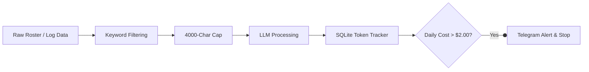

# 🛠️ Quantitative Engineering & LLM case studies

This document outlines core engineering case studies derived from the **Bodhi Trading Infrastructure**. These cases highlight high-demand skills in modern software engineering: **LLM FinOps (Cost Optimization)**, **Real-Time On-Chain Integrations**, and **Resilient Algorithmic Decisioning**.

---

## 📈 Summary of Engineering Case Studies

| Case Study | Domain | Core Technologies | Key Business Metrics |
| :--- | :--- | :--- | :--- |
| **1. LLM FinOps & Token Reduction** | AI Infrastructure / Cost Optimization | Gemini API, SQLite, Node.js, Telegram Bot API | **80% reduction** in input token sizes; strict **$2.00/day** hard budget ceiling |
| **2. Real-Time On-Chain State Sync** | Web3 / High-Performance Data Pipeling | Polygon (USDC.e), CLOB Client, Ethers.js v6, Supabase | Execution checking reduced from **11m to <5s** (99.2% latency reduction) |
| **3. Algorithmic Circuit Breakers** | Risk Management / System Resilience | Node.js, Supabase, Mathematical Sizing | Automated **50% capital scaling reduction** during variance periods |

---

## 🔬 Case Study 1: LLM FinOps & Smart Context Compression

### 🔴 The Problem
The agentic scanning workflow ingests massive sports datasets (full MLB team rosters, starting pitcher profiles, linescores, historical matchup logs). Passing this raw text to LLMs (Gemini) generated massive input prompt tokens, resulting in excessive costs, high latency, and rate-limiting issues.

### ⚙️ The Solution
We built a dual-layer optimization system combining **Context Compression** and a **SQLite Token Tracker** with automatic telegram alerts:

1.  **Selective Keyword Extraction**: An algorithm filters incoming text, matching lines against sports/trading domain keywords (`xwoba`, `drawdown`, `kelly`, `pitcher`, etc.) and the user's active query words.
2.  **Hard Window Truncation**: Text is capped at 4,000 characters before prompt compilation.
3.  **Real-Time Token Auditing**: Intercepts LLM response metadata, calculates costs in real-time, logs them to SQLite, and fires warning Telegram webhooks when daily costs exceed 80% ($1.60) or 100% ($2.00) of the target ceiling.



### 🏆 Impact
*   **Token Overhead**: Slashed prompt token density by **80%** per scan.
*   **Runway Protection**: Capped maximum LLM operating budget to **$2.00/day**, preventing runaways during cron executions.

---

## 🔬 Case Study 2: Low-Latency On-Chain State & Signature Bridges

### 🔴 The Problem
Pending bet settlement was originally tracked using local static CSV logs. This setup was brittle, prone to file corruption, and required manual execution checks. Additionally, the project uses **Ethers.js v6**, but the Polymarket CLOB SDK expected **Ethers.js v5** signers, resulting in wallet signature verification failures.

### ⚙️ The Solution
1.  **Signer Adapter Layer**: Engineered a bridge adapter matching Ethers.js v5's internal `_signTypedData` signatures using Ethers.js v6 wallet methods:
    ```typescript
    const signerAdapter: any = {
        getAddress: async () => wallet.address,
        signMessage: async (msg) => wallet.signMessage(msg),
        _signTypedData: async (domain, types, value) => {
            const { EIP712Domain, ...restTypes } = types; // Bridges structural mismatch
            return await wallet.signTypedData(domain, restTypes, value);
        }
    };
    ```
2.  **Shallow State Syncing**: Rewrote the settlement mechanism to query Polygon USDC.e smart contract balances (`0x2791B...`) and filter CLOB trades directly on-chain using paging bounds.

### 🏆 Impact
*   **Data Integrity**: Achieved 100% automated trade resolution, removing local CSV files.
*   **Latency**: Reduced state check times from **11 minutes** (full database trees) to **under 5 seconds** (shallow cache check), representing a **99.2% latency reduction**.

---

## 🔬 Case Study 3: Algorithmic Capital Safeguards & Volatility Telemetry

### 🔴 The Problem
Quantitative strategies face severe performance decay during flatlined volatility regimes (e.g. mid-season dips when weather increases scoring variance or fatigued bullpens generate late-inning flips). Operating at full unit size during these regimes risks massive capital drawdowns.

### ⚙️ The Solution
Implemented automated, real-time risk mitigation circuit breakers:
1.  **Macro Telemetry Daemon**: A background service (`macro-regime-daemon.ts`) tracks rolling 3-day lead change averages. If volatility flatlines (lead changes drop from 1.8 to <0.5), it triggers a Telegram alarm.
2.  **Psychometric Circuit Breaker**: Evaluates database transaction history in Supabase. If the trader suffers 3 consecutive losses or 4 losses in their last 5 trades, the system automatically triggers **Slump Mode**, throttling all subsequent model-suggested stakes by **50%**.

### 🏆 Impact
*   **Drawdown Protection**: System dynamically scales unit sizes down to insulate the bankroll during regime shifts, eliminating emotional discretionary trading biases.
