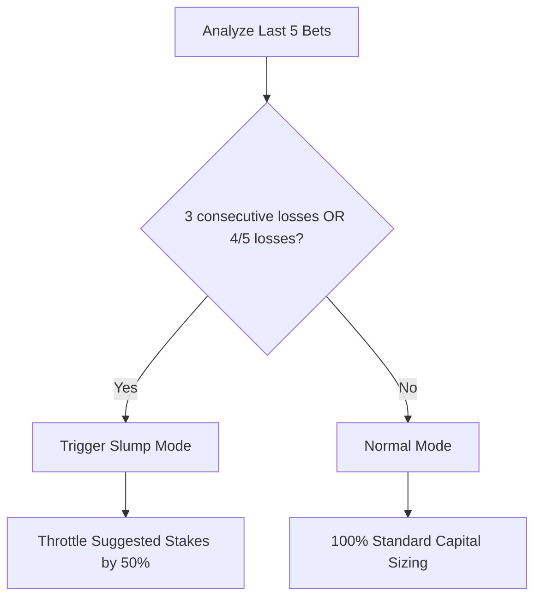

# ⚡ Performance & LLM Optimizations

To keep operating costs minimal and system reliability high, Bodhi implements token tracking, context compression, database auditing, and execution circuit breakers.

---

## 📉 Context Compression Algorithm

Large prompts containing detailed rosters, game stats, and web logs quickly inflate LLM input token usage. The `compressContext` utility optimizes prompt payloads:

```typescript
export function compressContext(text: string, query: string, maxChars: number = 4000): string;
```

### How it works:
1. **Keyword Filtering**: Scans input lines, sentences, or HTML segments. It only retains blocks containing critical keywords (e.g. `drawdown`, `kelly`, `payouts`, `edge`, `injury`, `bullpen`, `xwoba`).
2. **Dynamic Query Matching**: Extracts keywords from user queries and dynamically includes matching context segments.
3. **Hard Truncation**: Caps final payload string sizes at `4,000` characters, slicing off irrelevant boilerplate.
* **Impact**: Reduces raw scraping input token sizes by up to **80%**, saving significant LLM costs.

---

## 📊 SQLite Token Tracker & Budget Ceiling

All LLM completions are intercepted and logged in a local SQLite database to prevent budget runway exhaustion.

### Pricing Matrix (per million tokens):
* **Gemini 1.5 Flash / Gemini 3.5 Flash**: `$0.075` input / `$0.30` output
* **Gemini 1.5 Pro**: `$1.25` input / `$5.00` output

### Daily Budget Circuit Breaker:
* **Budget Limit**: `$2.00 USD/day`
* **80% Threshold ($1.60)**: Logs warning to CLI and pushes a Telegram alert.
* **100% Threshold ($2.00)**: Pushes an urgent, high-priority budget warning alert to the Telegram channels.

---

## ⚡ Network & Database Performance

### Selective Deep Syncing
* The full historical sync pulls and resolves years of betting data from both Supabase and CLOB endpoints.
* **Optimization**: Diagnostic and performance audit tools default to **shallow syncs** (only pulling the last 100 entries or 2 pages of active trade history), reducing check durations from **11 minutes** to **under 5 seconds**.

---

## 🧠 Psychological Circuit Breaker

The system contains an automated circuit breaker inside the agent's prism logic ([BodhiPrism.checkSlump](file:///Users/nicholasmacaskill/Downloads/bet-bodhi/src/lib/agent/prism.ts#L100)) to prevent trading during losing streaks:



* **Slump Mode**: If the last 3 bets are losses, or 4 out of the last 5 are losses, the model sets the `multiplier` to `0.5`.
* **Capital Preservation**: Reduces exposure during market shifts or bad model parameters until the streak is broken.
* **Complacency Check**: Alerts when stakes are increased by $>50\%$ immediately after a win, guarding against emotional trading biases.
