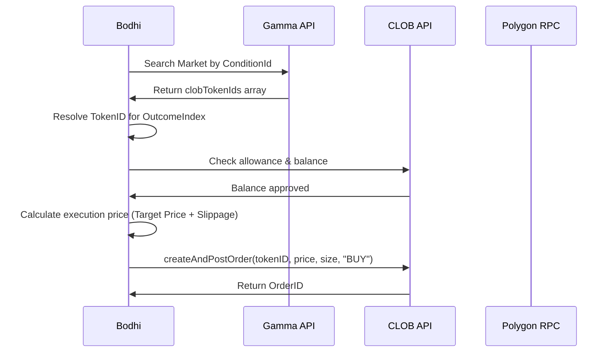

# 🔗 Web3 & Polymarket Chain Integration

The Bodhi system executes trades directly on the Polymarket Central Limit Order Book (CLOB). This document explains the smart contract addresses, APIs, and client SDK adapters used to bridge our off-chain model recommendations to on-chain execution.

---

## 🌐 API Infrastructure

We interact with Polymarket via two distinct API environments:

```
                  ┌───────────────────────────────────────────┐
                  │                Bodhi Agent                │
                  └─────────────┬─────────────────────────────┘
                                │
               ┌────────────────┴────────────────┐
               ▼                                 ▼
┌─────────────────────────────┐   ┌─────────────────────────────┐
│          Gamma API          │   │          CLOB API           │
│  gamma-api.polymarket.com   │   │     clob.polymarket.com     │
├─────────────────────────────┤   ├─────────────────────────────┤
│  • Public read-only         │   │  • Authenticated reads      │
│  • Market catalogs          │   │  • Order execution          │
│  • Outcome prices & volume  │   │  • Account trade history    │
└─────────────────────────────┘   └─────────────────────────────┘
```

---

## 🔑 Wallet & Signer Configuration

The CLOB Client SDK requires an Ethers v5 signer object. Since this project is built using **Ethers v6**, a custom adapter bridges the versions without requiring dual-dependency bloating:

```typescript
const signerAdapter: any = {
    getAddress: async () => wallet.address,
    signMessage: async (message: string | Uint8Array) => wallet.signMessage(
        typeof message === 'string' ? message : ethers.hexlify(message)
    ),
    _signTypedData: async (domain: any, types: any, value: any) => {
        const { EIP712Domain, ...restTypes } = types; // Ethers v6 strips EIP712Domain internally
        return await wallet.signTypedData(domain, restTypes, value);
    },
    connect: () => signerAdapter
};
```

### Proxy Wallet Structure
If `POLY_PROXY_ADDRESS` is defined in `.env`, the client initializes with Polymarket’s proxy wallet signature type (`SignatureType.POLY_PROXY = 1`). This allows the agent to execute trades funded by a smart contract proxy wallet (Gnosis Safe / Polymarket proxy) signed by the owner's EOA private key.

---

## 💰 On-Chain Collateral & Balance Resolution

Polymarket settlement and trading collateral uses **USDC.e** (bridged USDC) on Polygon:
* **Contract Address**: `0x2791Bca1f2de4661ED88A30C99A7a9449Aa84174`
* **RPC Endpoint**: `https://polygon-bor-rpc.publicnode.com` (Polygon Chain ID: `137`)

### Balance Resolving Logic
1. **First Attempt**: Queries `client.getBalanceAllowance({ asset_type: "COLLATERAL" })` via the CLOB. This retrieves the total collateral deposited into the Polymarket exchange contract.
2. **Fallback**: Queries the raw ERC-20 `balanceOf` function on the USDC.e contract for the EOA or Proxy Wallet address using Ethers.js.

---

## 🏹 Order Execution Flow

When executing a trade (e.g. via `place-bet.ts` or during manual action confirmation):



### Slippage Protection
All order execution commands are placed as **bounded limit orders**. The execution price is set to:

$$\text{Execution Price} = \min(\text{Target Price} + \text{Slippage}, 0.99)$$

* **Default Slippage**: `$0.05`
* This behaves like a market order but guarantees the transaction fails if the price moves against the bot by more than 5 cents before execution.

---

## 🛡️ Safety Constraints

* **Maximum Stake Limit**: Enforced via `MAX_TEST_STAKE` (currently `$35.00`). If any model recommends a stake above this value, the CLOB client throws an error and halts execution.
* **Allowance Approvals**: If the client returns an error containing `"allowance"`, the EOA must submit an ERC-20 approval transaction allowing the Polymarket Exchange contract to spend USDC.e.
