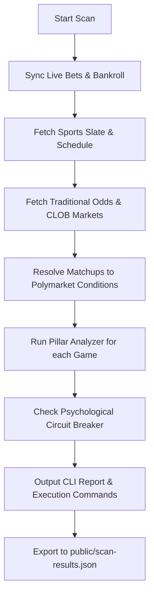

# 🏛️ Bodhi Scanner Architecture

The **Bodhi Scanner** is an automated pipeline designed to discover, evaluate, and execute +EV (Expected Value) trading opportunities across Web3 prediction markets (primarily Polymarket) for sports.

---

## 🔄 Execution Pipeline

The core execution entrypoint is [daily-scanner.ts](file:///Users/nicholasmacaskill/Downloads/bet-bodhi/scripts/daily-scanner.ts). When invoked, it runs through the following sequence:

### 1. Synchronization & Bankroll Verification
* **Sync Service**: Runs [SyncService](file:///Users/nicholasmacaskill/Downloads/bet-bodhi/src/lib/agent/sync-service.ts) to log pending results, reconcile history, and update individual team profiles.
* **On-Chain Balance**: Interacts with the Polymarket CLOB and Polygon RPC to retrieve the live USDC.e balance. If balance checks fail or return zero, it falls back to a manual bankroll ceiling (default: `$464.00`).

### 2. Multi-Sport Data Ingestion
The scanner fetches schedule, lineup, and roster data concurrently across 5 distinct sports engines:
* **MLB**: Fetching pitching matchups, daily lineups, platoon splits, bullpen fatigue metrics, and hot hitter lists via [MLBApi](file:///Users/nicholasmacaskill/Downloads/bet-bodhi/src/lib/mlb-api.ts).
  * **Live Matchup Pitcher Fallback**: If a game is live/active, MLB API clears the `probablePitchers` field. The `MLBApi` detects this case and falls back to queries on the live boxscore (`boxscore.teams.home.pitchers` and `boxscore.teams.away.pitchers`), dynamically extracting the active pitcher roster ID to resolve current matchups.
* **NHL**: Fetching goalie matchup statistics (SV%, GAA) and team standings via [NHLApi](file:///Users/nicholasmacaskill/Downloads/bet-bodhi/src/lib/nhl-api.ts).
* **NBA**: Fetching team form, rosters, and schedules via [NBAApi](file:///Users/nicholasmacaskill/Downloads/bet-bodhi/src/lib/nba-api.ts).
* **MMA**: Fetching card lineups, location, and fighter metrics via [MMAApi](file:///Users/nicholasmacaskill/Downloads/bet-bodhi/src/lib/mma-api.ts).
* **KBO (Korean Baseball)**: Fetching schedules, rosters, starting pitchers, and linescore data via [KBOApi](file:///Users/nicholasmacaskill/Downloads/bet-bodhi/src/lib/kbo-api.ts). 
  * **API Resilience & Scraper Fallbacks**: Uses a dual-layered pipeline fetching structured schedule feeds from internal KBO endpoints, with a resilient fallback mechanism parser in case KBO returns unstructured/HTML error tokens during live schedule fetches.

### 3. Market Resolution & Odds Ingestion
For every retrieved matchup, the scanner searches the active sports markets resolved from the Polymarket Gamma API. It utilizes mascot-based fuzzy matching (e.g. comparing "Marlins" and "Angels" in the Polymarket question text) and falls back to a direct query via the `getMarketByTeams` method.

### 4. Pillar Evaluation
The matched game is sent to the corresponding `PillarAnalyzer` (e.g., [PillarAnalyzer](file:///Users/nicholasmacaskill/Downloads/bet-bodhi/src/lib/pillar-analyzer.ts) for MLB, [NHLPillarAnalyzer](file:///Users/nicholasmacaskill/Downloads/bet-bodhi/src/lib/nhl-pillar-analyzer.ts) for NHL, etc.).

---

## 📊 Nightly Scanner & Report Dispatching

The [nightly_full_report.ts](file:///Users/nicholasmacaskill/Downloads/bet-bodhi/scripts/scanners/nightly_full_report.ts) orchestrates the nightly full-slate sports scans and handles live updates.

### 1. Scan Modes
* **`PRE_GAME`**: Executes before slate kickoffs. It evaluates the raw roster strengths and records the initial baseline report to `reports/BODHI_SOVEREIGN_REPORT_{today}.md`.
* **`LIVE_UPDATE`**: Triggered automatically if a baseline report file exists and live game events (in-progress, completed, postponed) are detected on the MLB/KBO slates. It separates games into `Actionable: Upcoming Games` and `Live Tracking: In-Progress & Completed` sections in the updated markdown report.

### 2. Telegram & Telegraph Integration
* **Pillar Redaction**: To keep the Telegram reports clean, any context wrapped in `<!-- TELEGRAM_EXCLUDE_START -->` ... `<!-- TELEGRAM_EXCLUDE_END -->` tags (such as raw model confidence factor pillars) is programmatically stripped using regex replacements before pushing to Telegraph.
* **Dual-Message Dispatch**: During a `LIVE_UPDATE` scan, the scanner generates two distinct Telegraph pages: the **Original Pre-Game Report** and the **Updated Live Report**. Since Telegram only displays the Instant View block for the first URL in a message, the scanner publishes them as two separate consecutive Telegram message dispatches, forcing the client to render both Instant View previews natively in the chat feed.
* **Bot Notification Deduplication**: The [telegram-bot.ts](file:///Users/nicholasmacaskill/Downloads/bet-bodhi/scripts/telegram-bot.ts) parses scanner logs and detects if two links were pushed. If they were, the bot suppresses the redundant third `/scan` confirmation link message, displaying only the consolidated mood and risk multiplier sentiment status.

---

## 🎛️ Unified Agent Interface: Bodhi Prism

To make the codebase fully accessible to autonomous AI agents, [BodhiPrism](file:///Users/nicholasmacaskill/Downloads/bet-bodhi/src/lib/agent/prism.ts) acts as a unified facade. Instead of agents calling scripts or isolated classes directly, they use Prism to:
1. Scan leagues (`scanMLB`, `scanNHL`).
2. Fetch current bankroll state and user profiles (`getUserState`).
3. Analyze historical psychological biases (`analyzeBiases`).
4. Apply the circuit breakers (`checkSlump`).
5. Record logs directly into Supabase (`recordBet`).
